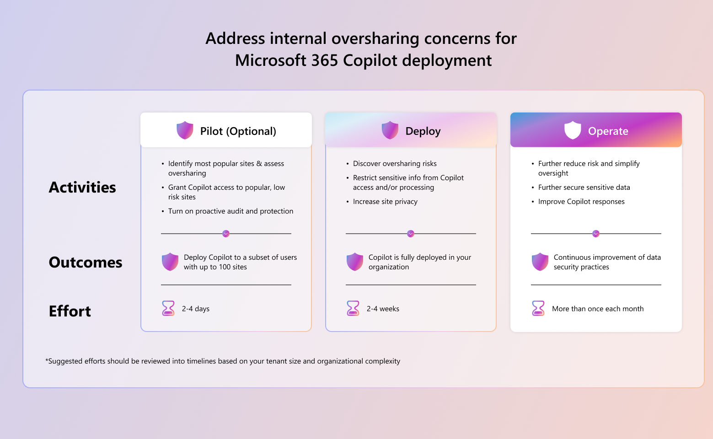

# Control oversharing of organization data that Copilot agents can access

To help ensure that the data agents access is appropriate, it should be safeguarded to prevent oversharing. Preventing oversharing data helps ensure that sensitive data remains protected, and access is limited to only those users who need it, including Copilot agents. Using a combination of [Microsoft Purview Data Security Posture Management (DSPM) for AI](/purview/dspm-for-ai) and [SharePoint Advanced Management](/sharepoint/advanced-management) assists you with controlling oversharing.

> [!NOTE]
> This article describes features from multiple products. Some features described in this article might not be available depending on which Microsoft 365 subscription you have. For more information, see the [Microsoft 365 licensing guide](https://www.microsoft.com/licensing/product-licensing/microsoft-365) and review the product's licensing requirements documentation.

## Use the data risk assessment in Microsoft Purview Data Security Posture Management (DSPM) for AI to address oversharing

Microsoft Purview Data Security Posture Management (DSPM) for AI from the [Microsoft Purview portal](/purview/purview-portal) provides a central management location to help you quickly secure data for AI apps and proactively monitor AI use. DSPM for AI helps you identify, monitor, and manage data risks associated with AI workloads. It provides visibility into your data landscape, enabling you to detect sensitive data and assess its exposure to AI systems, including Copilot agents.

Use the [data risk assessments](/purview/dspm-for-ai?tabs=m365#data-assessments) in DSPM for AI to:

- Identify potential oversharing risks and get recommendations to reduce those risks
- Protect sensitive data from oversharing
- Monitor, remediate, and automate protections to reduce emerging risks

:::image type="content" source="10687243-dspm-overview-copilot.png" alt-text="DSPM overview page for Microsoft 365 Copilot":::

## Control oversharing with SharePoint Advanced Management

Controlling oversharing is vital for ensuring that Copilot agents only access appropriate data. [SharePoint Advanced Management](/sharepoint/advanced-management) helps you identify and manage the following common content governance concerns:

- **Content oversharing and access control for content**: Limiting content access to individuals and agents who need it reduces the risk of oversharing information. SharePoint Advanced Management's integration with [Microsoft Purview](/purview/purview) helps you safeguard, govern, and manage your sensitive content.
- **Content sprawl**: Ensuring proper site management and content creation reduces content duplication and helps maintain an efficient well-organized SharePoint environment
- **Content lifecycle management**: Using accurate up-to-date content improves efficiency for both users and agents.  

Reducing content sprawl and managing content lifecycle are important for overall SharePoint governance and they contribute to making controlling oversharing easier. For more information, see, [Get ready for Microsoft 365 Copilot with SharePoint Advanced Management](/sharepoint/get-ready-copilot-sharepoint-advanced-management).

:::image type="content" source="10687243-sam-feature-list.png" alt-text="SharePoint Advanced Management feature list":::

## Recommended approach to address oversharing concerns for Microsoft 365 Copilot deployments

To effectively address oversharing of data that Copilot agents can access, use the [deployment blueprint](/copilot/microsoft-365/microsoft-365-copilot-blueprint-oversharing). The blueprint uses a standard three phase approach of **pilot** > **deploy** > **operate**. The blueprint provides prescriptive guidance for admins to address oversharing concerns for Microsoft 365 Copilot deployments with recommended actions specific to E3 or E5 licenses for each phase.

**Download the blueprint and documentation**:

| Deployment model | Description |
|---|---|
|  | Use this deployment model to assist organizations in identifying and mitigating oversharing risks.   **This model includes** <ul><li>Blueprint with high level activities and presentation [PDF](https://aka.ms/Copilot/OversharingBlueprintPDF) \| [PowerPoint](https://aka.ms/Copilot/OversharingBlueprintPPT)</li></ul> |

