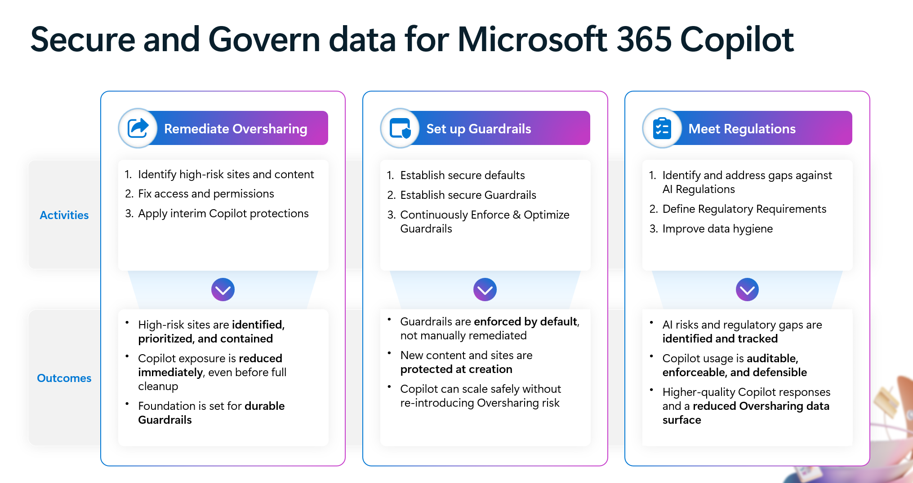

# Secure & governed data foundation for Microsoft 365 Copilot: A deployment blueprint

Microsoft 365 Copilot can accelerate how people find information, summarize content, and get work done—by grounding responses in the data users already have permission to access. To realize that value confidently, organizations need a foundation that's secure and governed, equipped with robust guardrails, and aligned with AI regulations. 

Common challenges like content sprawl, stale sites, and overly broad sharing can reduce answer quality and increase the likelihood that Copilot surfaces information more widely than intended. By implementing reliable guardrails and ensuring compliance with regulatory obligations, you can further minimize risks and help ensure that Copilot delivers accurate, responsible results within a trusted environment.

## How this blueprint can help you secure and govern your data foundation

This deployment blueprint outlines the essential steps for establishing a secure and governed foundation for Copilot by remediating oversharing, implementing reliable guardrails, and fulfilling AI-related regulatory obligations, delivering a straightforward, approachable path to help every organization get started with confidence.

This blueprint is organized into three pillars:

- Remediate oversharing
- Set up guardrails
- Meet regulations

:::image type="content" source="media/secure-govern-data-microsoft-365-copilot/secure-govern-data-microsoft-365-copilot.png" alt-text="Diagram depicting the blueprint for securing and governing data for Microsoft 365 Copilot." lightbox="media/secure-govern-data-microsoft-365-copilot/secure-govern-data-microsoft-365-copilot.png":::

### What the blueprint covers

The blueprint covers the following areas:

- A practical framework to reduce Copilot exposure quickly, then harden your environment with enforceable defaults
- Guidance powered by:
   - [Microsoft Purview](/purview/), which enables secure and governed Copilot deployment by providing tools to prevent data loss, mitigate insider risk, and ensure compliance with organizational and regulatory requirements for both Copilot at runtime and Microsoft 365 data referenced by Copilot
   - [SharePoint Advanced Management](/sharepoint/advanced-management) (SAM), which is included with your Microsoft 365 Copilot license. SAM provides capabilities for managing sharing, access, and governance across SharePoint.
- Recommended admin actions to identify high-risk sites and files, apply interim access restrictions if needed, fix access issues, and continuously enforce secure guardrails.
- Identifying and closing gaps in AI regulatory requirements, defining audit and legal requirements, and enhancing data hygiene for sites and files. 

## Download the blueprint and documentation

| Deployment model | Description |
|---|---|
|  | Use this blueprint to remediate oversharing, enforce guardrails, and meet AI regulations for a Microsoft 365 Copilot deployment.  **Includes:** - Blueprint overview and activities: [PDF](https://aka.ms/Copilot/OversharingBlueprintPDF) \| [PowerPoint](https://aka.ms/Copilot/OversharingBlueprintPPT) |

## Related guidance

- [Microsoft Purview blueprint: Secure by default](/purview/deploymentmodels/depmod-securebydefault-intro)
- [Configure a secure and governed foundation for Microsoft 365 Copilot](configure-data-security-copilot.md)
- [SharePoint Advanced Management](/sharepoint/advanced-management)
