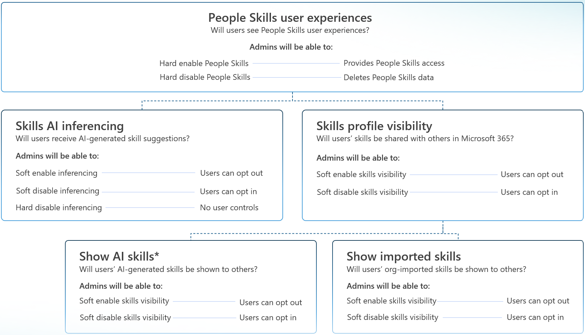

# Manage admin controls in People Skills

People Skills offers a variety of controls for Admin users to configure privacy settings, skill visibility, and access management within the Microsoft 365 Admin Center. By using these controls, you can meet your organization's needs and comply with local regulatory or business requirements. These settings can also be used to selectively deploy People Skills to a small group of pilot users, while restricting functionality to the rest of your tenant. People Skills provides access controls using [Feature Access Management](/viva/feature-access-management). By understanding these controls, you can deploy People Skills in a compliant, flexible manner—whether to your entire tenant, specific groups, or a small set of pilot users.


#### Example use-cases for when these controls may be valuable:

- __Workers Council or Regional Compliance Requirements__

  If your organization operates in a region with Workers Council requirements and needs to disable People Skills for users in that area (for example, users in Germany), you have several options for configuring compliance‑appropriate access controls. For example, you can use the **AI Inferencing control** to disable AI‑generated skill inferences while still allowing users to opt in if they choose. Alternatively, you can use the **People Skills user experiences control**, which fully disables all People Skills experiences for the selected user group; this higher-level control removes all People Skills user experiences for those users and is commonly used to meet regional compliance needs.
  
- __Piloting People Skills with a Test Group__

  If you want to roll out People Skills gradually, you can enable it only for a small pilot group while keeping it turned off for the rest of your tenant. The __People Skills user experiences control__ lets you turn the experience on for the pilot group and off for everyone else.
  
- __Limiting Skill Visibility for Privacy or Data Boundaries__

  If you need to restrict how widely Skills data is shared within your organization, you can adjust the default sharing behavior using the **Skills** __Profile Visibility Control__ to disable skill sharing. Individual users can still choose to opt in if they prefer.
  
- __Blocking AI from Automatically Adding Skills__

  If you do not want AI to infer or add skills to users’ profiles, you can use the __AI Inferencing Control__ to fully disable AI-generated skills across the selected users.
  
## Overview of People Skills Admin Controls

As an admin, you may manage People Skills through the following controls:


| Feature Control| What it does|Access Settings|Default setting|Relationships to other controls|
| -------- | -------- | -------- | -------- | -------- |
|People Skills user experiences|Turns all People Skills user experiences on or off for selected users. |On (hard enable); or Off (hard disable) |On|This is a parent control to all other admin controls. If this is turned off, then all other controls will be turned off. |
|Skills AI Inferencing|Determines whether AI can infer Skills for users and add them to their M365 profiles on their behalf.  |On, users can opt out (soft enable); or Off, users can opt in (soft disable); or Off (hard disable) |On, users can opt out (soft enabled) |This is a parent to the **Show AI Inferred Skills** control. This is a child to the **People Skills user experiences** control. |
|Skills Profile Visibility |Controls whether any of a user's skills (AI-inferred, Confirmed, or Imported) are shown on the user's M365 Profile Card or shared with other M365 applications.|On, users can opt out (soft enable); or Off, users can opt in (soft disable); or Off (hard disable) |On, users can opt out (soft enabled) |This is a parent to the **Show AI Inferred Skills** control and the **Show Imported Skills** control. This is a child to the **People Skills user experiences** control. |
|Show AI-Inferred skills|Controls whether AI-Inferred Skills are shown on the user's M365 Profile Card or shared with other M365 applications. |On, users can opt out (soft enable); Off, users can opt in (soft disable); or Off (hard disable) |On, users can opt out (soft enabled) |This is a child to the **Skills Profile Visibility** control, and the **People Skills user experiences** control. |
|Show Imported Skills|Controls whether imported (also known as organization-added) skills are shown on the user's M365 Profile Card or shared with other M365 applications.|On, users can opt out (soft enable); Off, users can opt in (soft disable); or Off (hard disable) |On, users can opt out (soft enabled) |This is a child to the **Skills Profile Visibility** control, and the **People Skills user experiences** control.|

All controls can be scoped at either the entire tenant level, to specific user groups, or to individual users. You configure these controls using [Feature access management](/viva/feature-access-management), available in:

- Microsoft Admin Center, or

- PowerShell

Admins can set controls at any time: before, during, or after deployment.  To view your admin settings, you can navigate to the People Skills setup page and select **Settings**.

> [!IMPORTANT]
> Changes in Feature access management take up to 24 hours to complete, and end-to-end changes may take up to 72 hours to fully propagate across all experiences. 

#### **Key terminology**

When managing these Admin Controls, please refer to the below table for important definitions of terms referenced throughout this page.  

| Term| What it means|
| -------- | -------- |
|Hard disable| Feature is fully disabled (turned off) and users cannot opt in|
| Soft disable|Feature is available but default off, and users may opt in |
|Soft enable|Feature is available and default on, and users may opt out|
|Parent control|A parent control determines the access settings of its child controls. When the parent it turned off, all child controls automatically inherit that setting and are also turned off. For example, the **People Skills user experiences** control is a parent for all other admin controls; if the People Skills user experiences is turned off, every related control beneath it is disabled as well. |
|Child control|A child control are controls that sit beneath a parent feature and depend on the parent's access state. A child control can only be applied if its parent feature is turned on. When the parent is disabled, all associated child controls automatically became disabled (they inherit their parent's access setting). |

See below visual diagram for an illustration of the relationships between the controls. 



## Managing the People Skills user experiences control

As an Admin, you can use the __People Skills user experiences__ control to turn off People Skills user experiences for your entire organization, user group subsets, or individual users. This is the highest level-parent control – it disables all People Skills user experiences entirely for selected users and will also override and replace the access settings of all other controls. 

#### What happens when People Skills user experiences are turned off?

Turning off People Skills permanently deletes all historical user-level data for the affected users, including confirmed skills, AI-inferred skills, and any imported skills.

> [!IMPORTANT]
> The skills library will not be deleted or deprovisioned when People Skills user experiences control is turned off. Only user level data will be deleted. 

Once People skills is turned off for a user, all People Skills user experiences will be removed for that user, including but not limited to: 

- People Skills in Viva Learning

- People Skills in M365 Profile Card

- Copilot experiences

[Please click here for a list of all the surfaces where People Skills data will be impacted by this Admin Control](/copilot/microsoft-365/people-skills-overview). Additionally, no new skills data is collected and Admins cannot import custom skills for disabled users. Users can be re-enabled later but lost skills data is not restored.


#### Visibility behavior when some users are disabled

When People Skills is disabled for some users but enabled for others, those disabled users may still be able to view or retrieve skills data from enabled users in certain experiences, such as Copilot or Microsoft 365 profile cards. This may occur when People Skills user experiences are turned off for a subset of users within your organization, and Skills Profile visibility (used to control skills   sharing) remains enabled for other users who have People Skills turned on. If the Admin would like to turn off skills visibility for users, [then learn more about how to control People Skills sharing and visibility here.](/copilot/microsoft-365/people-skills-sharing-inferencing-controls)

__Example:__

- Both User A and B are licensed for People Skills

  - _User A_ is part of a small-scale People Skills pilot
  
  - _User B_ is not part of the pilot
  
- User C is not licensed for People Skills and has User Profile Application (UPA) Skills instead

If the Admin turns off People Skills user experiences for User B, and keeps People Skills user experiences turned on for A, then User B may still be able to see user A's People Skills in Copilot or on the M365 Profile Card, provided User A has Skills visibility enabled and Skills sharing turned on. User B’s Microsoft 365 Profile Card will show no Skills experience when others view User B’s card. User C will see UPA Skills on their own M365 Profile Card, as well as for User A and User B. While User A and User B may not see their own UPA Skills on their M365 Profile Cards, they can still view, edit or delete them in SharePoint – [learn more about UPA Skills and People Skills here](/copilot/microsoft-365/people-skills-overview).

**Instructions on how to use this control:**

People Skills controls are configurable as features within [Feature access management](/viva/feature-access-management) either directly in the Microsoft 365 Admin Center or in PowerShell – select the following links to learn how to do this in either method you choose:

1.    [Go here to learn how to use this control directly in the M365 Admin Center via Feature access management](#_Manage_Admin_controls)

2.    [Go here to learn how to use this control in PowerShell via Feature access management](#_Feature_access_management)

## Manage the Skills AI inferencing control 

The Skills AI inferencing control determines whether AI can automatically generate skills for users based on their M365 activity and role. [Learn more about our AI Inference Engine here](/copilot/microsoft-365/people-skills-ai-inferencing). These AI-generated skills show on the user’s Microsoft 365 Live Profile Card (and are visible to others in the organization). When shown on the M365 Live Profile Card, AI-generated skills appear as gray, while Skills that a user has confirmed appear as blue with a checkmark. By default, AI inferencing is turned on for eligible users (Copilot and Viva users).  

The below table summarizes what access settings are available to Admins to set for this control: 

| Access setting| What it means|
| -------- | -------- |
|On, allow users to opt out (default) |When AI inferencing is soft enabled, users automatically receive AI-generated skills relevant to their role on their M365 Profile Card, unless the user opts out. Users may turn off (opt out of) AI inferencing for themselves in the Data and Privacy tab of their M365 Profile Editor page. If AI inferencing is turned on, and visibility controls are turned on (default behavior), then a user's AI-generated skills will show to other users in the organization when their profile card is viewed. |
|Off, allow users to opt in |When AI inferencing is soft disabled, no AI-generated skills will be created for a user, unless the user decides to opt themselves in. Users may still manually search for, add, and confirm skills from your organization's skill library. Skills that a user has confirmed appear in a blue box with a checkmark on their M365 profiles. |
|Off|When AI inferencing is hard disabled, then no AI-generated skills can be created. |

**Instructions on how to use this control:**

People Skills controls are configurable as features within [Feature access management](/viva/feature-access-management) either directly in the Microsoft 365 Admin Center or in PowerShell – select the following links to learn how to do this in either method you choose:

1.    [Go here to learn how to use this control directly in the M365 Admin Center via Feature access management](#_Manage_Admin_controls)

2.    [Go here to learn how to use this control in PowerShell via Feature access management](#_Feature_access_management)

## Manage the Skills profile visibility control 

The **Skills profile visibility** setting controls whether any skills (AI-inferred, confirmed, or imported) are shown and visible to other users via the Microsoft 365 Live Profile Card, and whether skills data is shared with other Microsoft 365 experiences, such as Copilot and leader dashboards and analytics. [Please click here for full list of all applications that use Skills data](/copilot/microsoft-365/people-skills-overview#where-does-people-skills-data-appear). This control does not impact whether Skills data is shared with Viva Learning – Skills data will continue to be shared with Viva Learning if your tenant has a Viva Learning license regardless of this control.

The **Skills profile visibility** control is a **parent control** to the **Show AI Skills** and **Show Imported Skills** controls; these two child controls automatically inherit whatever policy mode is set at the parent level. This means if **Skills profile visibility** is soft disabled, then **Show AI Skills** and **Show Imported Skills** will also be soft disabled – when all these controls are soft disabled, it means that a user’s confirmed skills, AI-inferred skills, and imported skills will not be visible to others in the organization unless the user chooses to opt in. Users can always opt in to show their Skills data with others if they want to.

The below table summarizes what access settings are available to Admins to set for this control: 

| Access setting| What it means|
| -------- | -------- |
|On, allow users to opt out (default) |Skills profile visibility is soft enabled (default), and all Skills that a user has (AI-inferred, confirmed, and/or imported) will show as visible to their colleagues (other users) within their organization on their M365 Profile Cards, and their Skills data will also be shared with [other applications](/copilot/microsoft-365/people-skills-overview#where-does-people-skills-data-appear) that use Skills. |
|Off, allow users to opt in |Skills profile visibility is soft disabled, and all Skills that a user has (AI-inferred, confirmed, and/or imported) are hidden on M365 Profile Cards (not shown to other users), and not shared with other applications, unless the user decided to opt themselves in. The **Show AI Skills** and the **Show Imported Skills** controls will also be soft disabled. |

> [!Note]
> We don't offer the option to hard disable **Skills Profile Visibility.** A user can always opt in to sharing their skills profile from their personal skills settings in Profile Editor. Admins can hard disable sharing of some skills such as AI-generated or imported skills (also referred to as organization added skills). 

**Instructions on how to use this control:**

People Skills controls are configurable as features within [Feature access management](/viva/feature-access-management) either directly in the Microsoft 365 Admin Center or in PowerShell – select the following links to learn how to do this in either method you choose:

1.    [Go here to learn how to use this control directly in the M365 Admin Center via Feature access management](#_Manage_Admin_controls)

2.    [Go here to learn how to use this control in PowerShell via Feature access management](#_Feature_access_management)

## Manage the Show AI-inferred Skills control

The **Show AI-inferred Skills** control determines whether AI-generated skills show as visible to others on the M365 Profile Card, and are shared with [other M365 applications that use Skills data](/copilot/microsoft-365/people-skills-overview#where-does-people-skills-data-appear). These skills are only visible if the parent controls (Skills Profile Visibility, People Skills AI inferencing, and People Skills user experiences) are also enabled (all controls are enabled by default).

The below table summarizes what access settings are available to Admins to set for this control: 

| Access setting| What it means|
| -------- | -------- |
|On, allow users to opt out (default) |This means that Show AI-inferred Skills is soft enabled, and AI-generated skills are shown as visible to colleagues on a user's M365 Live Profile Card and shared with other M365 applications. Users will have the ability to opt themselves out of showing AI-inferred skills. |
|Off, allow users to opt in |This means that Show AI-inferred Skills is soft disabled, and no AI-generated skills are shown as visible to colleagues on a user's M365 Live Profile Card nor are they shared with other M365 applications. |
|Off|This means that Show AI Inferred skills is fully disabled and users are not able to opt in. |


> [!NOTE]
> These AI-Inferred skills are only shared if Skills Profile visibility is also enabled or shared. If Skills Profile Visibility is disabled, AI-inferred skills won't be shown to other users or shared with any Microsoft 365 experiences.

**Instructions on how to use this control:**

People Skills controls are configurable as features within [Feature access management](/viva/feature-access-management) either directly in the Microsoft 365 Admin Center or in PowerShell – select the following links to learn how to do this in either method you choose:

1.    [Go here to learn how to use this control directly in the M365 Admin Center via Feature access management](#_Manage_Admin_controls)

2.    [Go here to learn how to use this control in PowerShell via Feature access management](#_Feature_access_management)

## Manage the Show Imported Skills control

The **Show Imported Skills** control determines whether Admin imported skills (also referred to as organization added skills) may be shown as visible on a user's profile. Imported skills are ones that an Admin chooses to import that may come from other HRIS or talent systems external to Microsoft People Skills. These imported skills would only be visible if the parent controls (Skills Profile Visibility, and People Skills user experiences) are also enabled (all controls are enabled by default).

The below table summarizes what access settings are available to Admins to set for this control:

|Access setting|What it means|
| -------- | -------- |
|On, allow users to opt out (default)|This means that any imported skills will be shown as visible to colleagues on a user's M365 Live Profile Card and shared with other M365 applications. Users will have the ability to opt themselves out of showing and sharing imported skills.|
|Off, allow users to opt in|This means that any imported skills will not be visible to colleagues on a user's M365 Live Profile Card nor are they shared with other M365 applications.|
|Off|This means that Show imported skills is fully disabled and users are not able to opt in.|

> [!NOTE]
> These imported skills are only shared if Skills Profile visibility is also enabled or shared. If Skills Profile Visibility is disabled, AI-inferred skills won't be shown to other users or shared with any Microsoft 365 experiences.

**Instructions on how to use this control:**

People Skills controls are configurable as features within [Feature access management](/viva/feature-access-management) either directly in the Microsoft 365 Admin Center or in PowerShell – select the following links to learn how to do this in either method you choose:

1.    [Go here to learn how to use this control directly in the M365 Admin Center via Feature access management](/editor/MicrosoftDocs/microsoft-365-docs-pr/copilot%2Fpeople-skills-sharing-inferencing-controls.md/main/8ee66ed8-c769-b7b3-580c-4bb829890c56/?branch=main)

2.    [Go here to learn how to use this control in PowerShell via Feature access management](/editor/MicrosoftDocs/microsoft-365-docs-pr/copilot%2Fpeople-skills-sharing-inferencing-controls.md/main/8ee66ed8-c769-b7b3-580c-4bb829890c56/?branch=main)

## Manage data sharing with Viva Insights

Admins have the ability to enable or disable People Skills data sharing with Viva Insights. If enabled, People Skills data (including AI-Inferred Skills data that a user has not confirmed) is sent to Viva Insights to populate skills dashboards and workplace analytics. Learn more about [People Skills in Viva Insights](/viva/insights/advanced/analyst/templates/skills-landscape).

**Steps to enable or disable sharing with Viva Insights**


1. Navigate to **Settings** in the left rail of the M365 Admin Center

1. Select **Viva** 

1. Select **Data management** and then

1. Select **People Skills**

1. Select **Settings**

1. Select **People Skills in Viva Insights**

1. To enable, check (or uncheck to disable) **Allow skills in Viva Insights**

> [!NOTE]
> Any historical data will still remain in Viva Insights even after disabling. 

## Manage People Skills controls in Feature access management

People Skills controls are configurable as features within Feature access management either directly in the Microsoft 365 Admin Center or in PowerShell. You can scope policies to specific users, groups, or your entire tenant. 

Below is some general guidance for creating policies:

**For pilots**

Use People Skills User Experiences control to disable the entire tenant and enable only for the pilot user group 

- Maintain compliance through explicit opt in defaults.

**For global rollouts**

Keep SoftEnable defaults where possible

Use HardDisable where regulations forbid AI processing or skill sharing

Monitor data flows into Viva Insights

**For regulated regions / Workers Council environments**

Use People Skills user experiences, inferencing and/or visibility policies to restrict specific groups

Use SoftDisable or HardDisable strategically per requirement. 

Validate user-level opt in rights and transparency.

### Configuring Admin controls in M365 Admin Center interface

You can access Feature access management in the M365 Admin Center by following the below instructions:

> [!IMPORTANT]
> When multiple policies apply to the same user, the [most restrictive policy takes precedence](/viva/feature-access-management#which-policy-takes-precedence). User/Group policies override organization-wide policies.
>
> **Example:** If you create two policies - one that disables a feature for everyone in your organization, and another that enables the feature for people in a specific group - the feature will be enabled for group members because the group policy takes precedence over the organization-wide policy.

The following sections will walk you through on how to set up each of the controls in detail, and the expected functionality when they're enabled or disabled.


## People Skills Controls to Feature Access Policies Overview

The four features for People Skills described above map to the below, and are all available to be set for the **tenant**, **group**, and **user** scopes.

| ModuleId | FeatureId | Policy Modes | Parent Feature | 
| --- | ---- | ------ | ---- |
| PeopleSkills |  SkillsInferencing | HardDisable, SoftDisable, SoftEnable | None
| PeopleSkills |  SkillsProfileVisibility |  SoftDisable, SoftEnable | None
| PeopleSkills |  ShowAISkills |  HardDisable, SoftDisable, SoftEnable | SkillsProfileVisibility
| PeopleSkills |  ShowOrgAddedSkills |  HardDisable, SoftDisable, SoftEnable | SkillsProfileVisibility


The Policy Modes supported for each feature map to the following PowerShell commands.

- **HardDisable**: The feature is disabled, users do not have the ability to opt-in or opt-out. This is controlled by setting the PowerShell property **-IsFeatureEnabled $false**. 

- **SoftDisable**: The user is opted-out by default. This is controlled by setting the PowerShell properties **-IsFeatureEnabled $true -IsUserControlEnabled $true -IsUserOptedInByDefault $false**. 

- **SoftEnable**: The user is opted-in by default. This is controlled by setting the PowerShell properties **-IsFeatureEnabled $true -IsUserControlEnabled $true -IsUserOptedInByDefault $true**.

> [!IMPORTANT]
> Make sure you have Exchange PowerShell version 3.8.0 or later if you plan to SoftDisable or SoftEnable, as property IsUserOptedInByDefault is only available on the newer module versions.

## Manage skills AI inferencing

Select **Skill inferencing by AI** under **Settings** to see details about the AI inferencing settings. People Skills provides access controls using [Feature Access Management](/viva/feature-access-management) to ensure you comply with user privacy and local regulations.

When inferencing is enabled, users receive AI-generated skills relevant to their role. When skills AI inferencing is turned off, no AI computation is processed for that user. The user can still create a skill profile by manually searching to add skills from your taxonomy. They can also confirm any imported skills that an admin in your organization adds for them.

Create an access control policy if you need to disable skill suggestions for specific users, groups, or your entire tenant. For more information on how to create and manage policies, see [control access to features](/viva/feature-access-management) and [Add-VivaModuleFeaturePolicy PowerShell command details](/powershell/module/exchangepowershell/add-vivamodulefeaturepolicy).

> [!NOTE]
> Policies for People Skills can only be created in PowerShell at this time. You can't create or manage policies through the interface in Admin center.

You have the following options for creating an access control policy in PowerShell to manage skills inferencing:  

- **Enable skills inferencing (Default):** When inferencing is enabled, users receive skill suggestions relevant to their role. Users have the option to turn it off for themselves in the Microsoft 365 profile editor, on the Data and privacy tab.

- **Keep skills inferencing enabled but default off:** Skills inferencing is available in your tenant, but users in this access policy will be "opted-out," and won't receive inferencing suggestions. Users have the option to turn it on for themselves in the Microsoft 365 profile editor, on the Data and privacy tab.

  To create this policy, run the following PowerShell cmdlet.

  ```powershell
  Add-VivaModuleFeaturePolicy -ModuleId PeopleSkills -FeatureId SkillsInferencing -Name SoftDisable -IsFeatureEnabled $true -IsUserControlEnabled $true -IsUserOptedInByDefault $false -Everyone
  ```

  > [!IMPORTANT]
  > The Feature Access Policy name values have to be unique, so make sure you are editing **-Name** in the PowerShell commands to names descriptive to your policy.

- **Completely disable skills inferencing:** With this policy, skills inferencing is disabled for your tenant and users can't opt in to receiving skill inferencing suggestions.

  To create this policy, run the following PowerShell cmdlet:
  
  ```powershell
  Add-VivaModuleFeaturePolicy -ModuleId PeopleSkills -FeatureId SkillsInferencing -Name HardDisable -IsFeatureEnabled $false -Everyone
  ```

  > [!NOTE]
  > In the PowerShell script, the **ModuleId** is *PeopleSkills*, and the **featureId** is *SkillsInferencing*. Replace `-Everyone` with your desired scope:
  > - `-Everyone` (entire organization)
  >
  > - `-GroupIds "group1@contoso.com","group2@contoso.com"` (specific groups)
  >
  > - `-UserIds "user1@contoso.com","user2@contoso.com"` (specific users)

For more details on PowerShell syntax, refer to **[our Feature Access Management documentation](/viva/manage-access-policies)**.
  
### Control visibility of entire user skills profile (Parent control)

This control can be used to control visibility of a user's entire skills profile. An individual's skills profile consists of AI-generated skills, user-confirmed skills, and imported skills.

By default, a user's skills profile is shown to others in their organizations and shared with other Microsoft 365 experience. If you need to disable sharing for specific users, groups, or your entire tenant, create an access control policy.

> [!NOTE]
> If sharing is disabled or "opted-out" by a user, all user skills will be private and won't be shown to other users or shared with any Microsoft 365 experiences.

You have the following options for creating an access control policy in PowerShell to manage visibility of entire user skills profile:  

- **Enable profile visibility (Default):** When visibility is enabled, users skills profile is shared across Microsoft 365. Users have the option to turn it off for themselves in their skill settings.

- **Keep profile visibility default off:** Users in this access policy will be "opted-out," and their skills won't be shared across Microsoft 365. Users have the option to turn it on for themselves in their skill settings.

  To create this policy, run the following PowerShell cmdlet:

  ```powershell
  Add-VivaModuleFeaturePolicy -ModuleId PeopleSkills -FeatureId SkillsProfileVisibility -Name SoftDisable -IsFeatureEnabled $true -IsUserControlEnabled $true -IsUserOptedInByDefault $false -Everyone
  
  ```

> [!NOTE]
> In the PowerShell script, the **ModuleId** is *PeopleSkills*, and the **featureId** is *SkillsProfileVisibility*. Replace `-Everyone` with your desired scope:
> - `-Everyone` (entire organization)
>
> - `-GroupIds "group1@contoso.com","group2@contoso.com"` (specific groups)
>
> - `-UserIds "user1@contoso.com","user2@contoso.com"` (specific users)
>
> For more details on PowerShell syntax, refer to **[our Feature Access Management documentation](/viva/manage-access-policies)**.
>
> We don't offer the option to completely disable skills profile visibility. A user can always opt in to sharing their skills profile from their personal skills settings in Profile Editor. Admins can disable sharing of some skills such as AI-generated, or org. added skills 

### Control visibility of AI-generated skills

AI-generated skills are provided to users based on their role and Microsoft 365 activity.

By default, a user's AI-generated skills are shown to others in their organizations and shared with other Microsoft 365 experiences. People Skills provides access controls using [Feature Access Management](/viva/feature-access-management) to ensure you comply with user privacy and local regulations.

> [!NOTE]
> These skills are only shared if Skills Profile visibility is also enabled or shared. If sharing is disabled, AI-generated skills won't be shown to other users or shared with any Microsoft 365 experiences.

If you need to disable sharing for specific users, groups, or your entire tenant, create an access control policy.

You have the following options for creating an access control policy in PowerShell to manage the visibility of AI-generated skill:  

- **Enable sharing of AI-generated skills (Default):** When visibility is enabled, AI-generated skills are shared across Microsoft 365. Users have the option to turn it off for themselves in their settings. Users can also manage how they can share AI-generated skills for themselves in the Microsoft 365 profile editor on the Data and privacy tab.

- **Keep the default sharing off for AI-generated skills**: Users in this access policy will be "opted-out," and their AI-generated skills won't be shared across Microsoft 365. Users have the option to turn it on for themselves in their skill settings.

  To create this policy, run the following PowerShell cmdlet:

  ```powershell
  Add-VivaModuleFeaturePolicy -ModuleId PeopleSkills -FeatureId ShowAISkills -Name SoftDisable -IsFeatureEnabled $true -IsUserControlEnabled $true -IsUserOptedInByDefault $false -Everyone
  ```

- **Completely disable sharing of AI-generated skills**: With this policy, AI-generated skills aren't shared with anyone but themselves and users can't opt in to sharing their AI skill suggestions before confirming them those skills.  

  To create this policy, run the following PowerShell cmdlet:

  ```powershell
  Add-VivaModuleFeaturePolicy -ModuleId PeopleSkills -FeatureId ShowAISkills -Name  HardDisable -IsFeatureEnabled $false -Everyone
  ```

  > [!NOTE]
  > In the PowerShell script, the **ModuleId** is *PeopleSkills*, and the **featureId** is *ShowAISkills*. Replace `-Everyone` with your desired scope:
  > - `-Everyone` (entire organization)
  >
  > - `-GroupIds "group1@contoso.com","group2@contoso.com"` (specific groups)
  >
  > - `-UserIds "user1@contoso.com","user2@contoso.com"` (specific users)
  >
  > For more details on PowerShell syntax, refer to **[our Feature Access Management documentation](/viva/manage-access-policies)**.

### Control visibility of third-party imported skills

Imported skills added by an admin in your organization from external systems display in a user's skills profile alongside AI-generated skills. Like AI-generated skills, these skills are available for the user to confirm in the Microsoft 365 profile editor. By default, third-party skills are displayed to others in their organizations and shared with other Microsoft 365 experiences. If sharing is disabled, imported skills won't display to others in the organization.

> [!NOTE]
> These skills are only shared if Skills Profile visibility is also enabled or shared. If sharing is disabled, third-party skills won't display to other users or get shared with any Microsoft 365 experiences.

If you need to disable sharing for specific users, groups, or your entire tenant, create an access control policy. For more information, see [Feature Access Management](/viva/feature-access-management).

You have the following options for creating an access control policy in PowerShell to manage third-party skills visibility imported by your organization:  

- **Enable third-party skills visibility (Default):** When visibility is enabled, third-party skills are shared across Microsoft 365. Users have the option to turn it off for themselves in their settings.

- **Keep imported skill sharing default off:** Users in this access policy will be "opted-out," and their third-party skills won't be shared across Microsoft 365. Users have the option to turn it on for themselves in their skill settings.

  To create this policy, run the following PowerShell cmdlet:
  
  ```powershell
  Add-VivaModuleFeaturePolicy -ModuleId PeopleSkills -FeatureId ShowOrgAddedSkills -Name SoftDisable -IsFeatureEnabled $true -IsUserControlEnabled $true -IsUserOptedInByDefault $false -Everyone
  ```

- **Completely disable imported skill sharing:** With this policy, third-party skills aren't shared with Microsoft 365 experience in your tenant and users can't opt in to sharing their third-party skills.

  To create this policy, run the following PowerShell cmdlet:
  
  ```powershell
  Add-VivaModuleFeaturePolicy -ModuleId PeopleSkills -FeatureId ShowOrgAddedSkills -Name HardDisable -IsFeatureEnabled $false -Everyone
  ```
  
  > [!NOTE]
  > In the PowerShell script, the **ModuleId** is *PeopleSkills*, and the **featureId** is *ShowOrgAddedSkills*. Replace `-Everyone` with your desired scope:
  > - `-Everyone` (entire organization)
  >
  > - `-GroupIds "group1@contoso.com","group2@contoso.com"` (specific groups)
  >
  > - `-UserIds "user1@contoso.com","user2@contoso.com"` (specific users)
  >
  > For more details on PowerShell syntax, refer to **[our Feature Access Management documentation](/viva/manage-access-policies)**.
  
## Manage skills data sharing with Viva Insights

When checked, skills data is passed on to Viva Insights. Skills in Viva Insights allows organizations and leaders to discover skills within their workforce and assess skill distribution across groups. Learn more about [People Skills in Viva Insights](/viva/insights/advanced/analyst/templates/skills-landscape).

You can stop skills data from being shared with Viva Insights by unchecking this setting.
