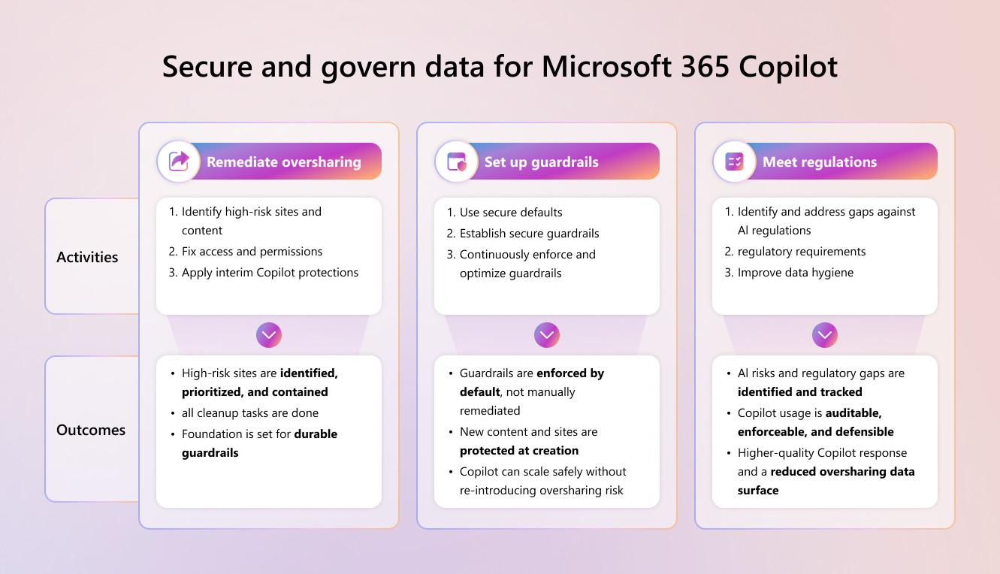

# Secure and govern Microsoft 365 Copilot: Foundational deployment guidance

Microsoft 365 Copilot can accelerate how people find information, summarize content, and get work done by grounding responses in the data users already have permission to access. To realize that value confidently, organizations require a foundation that is both secure and well-governed, with robust safeguards in place, including measures to protect interactions when using Copilot and meeting AI regulatory standards.

## How this blueprint can help you secure and govern Microsoft 365 Copilot

This deployment blueprint outlines the essential steps for establishing a secure and governed foundation for Copilot by remediating oversharing, implementing reliable guardrails, and fulfilling AI-related regulatory obligations, delivering a straightforward, approachable path to help every organization get started with confidence.

This blueprint is organized into three pillars:

- Remediate oversharing
- Set up guardrails
- Meet regulations

:::image type="content" source="media/secure-govern-copilot-foundational-deployment-guidance/secure-govern-copilot-blueprint.png" alt-text="Screenshot depicting the three pillars covered in the blueprint." lightbox="media/secure-govern-copilot-foundational-deployment-guidance/secure-govern-copilot-blueprint.png":::

[https://aka.ms/Copilot/SecureGovernBlueprintPDF](https://aka.ms/Copilot/SecureGovernBlueprintPDF)

### What the blueprint covers

The blueprint covers the following areas:

- A practical framework to reduce Copilot exposure quickly, then harden your environment with enforceable defaults

- Guidance powered by:
   - [Microsoft Purview](/purview/), which enables a secure and governed Copilot deployment by providing tools to prevent data loss, mitigate insider risk, and ensure compliance with organizational and regulatory requirements, for both Copilot at runtime and Microsoft 365 data referenced by Copilot
   - [SharePoint Advanced Management](/sharepoint/advanced-management) (SAM), which is included with your Microsoft 365 Copilot license. SAM provides capabilities for managing sharing, access, and governance across SharePoint.

- Recommended admin actions to identify high-risk sites and files, apply interim access restrictions if needed, fix access issues, and continuously enforce secure guardrails.

- Identifying and closing gaps in AI regulatory requirements, defining audit and legal requirements, and enhancing data hygiene for sites and files. 

## Download the blueprint and documentation

| Deployment model | Description |
|---|---|
|  | Use this blueprint to remediate oversharing, enforce guardrails, and meet AI regulations for a Microsoft 365 Copilot deployment.  **Includes:** - Blueprint overview and activities: [PDF](https://aka.ms/Copilot/SecureGovernBlueprintPDF) - [PowerPoint](https://aka.ms/Copilot/SecureGovernBlueprintPPT) |

## Related guidance

- [Microsoft Purview blueprint: Secure by default](/purview/deploymentmodels/depmod-securebydefault-intro)
- [Configure a secure and governed foundation for Microsoft 365 Copilot](configure-secure-governed-data-foundation-microsoft-365-copilot.md)
- [Microsoft Purview](/purview/)
- [SharePoint Advanced Management](/sharepoint/advanced-management)
- [Microsoft Zero Trust Assessment](https://microsoft.github.io/zerotrustassessment/guide)
