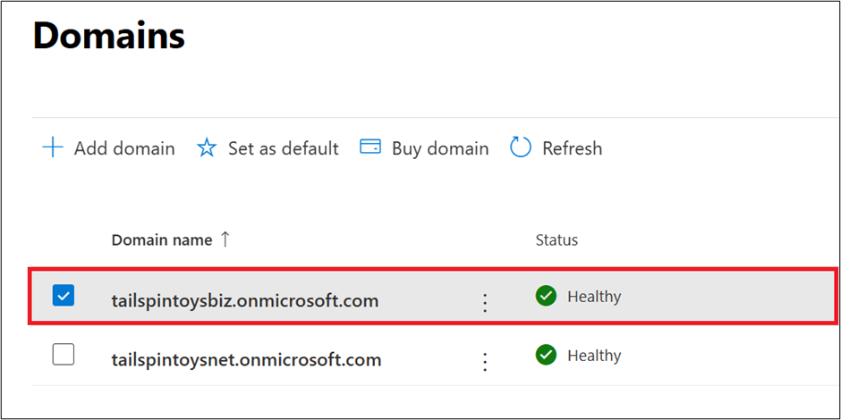
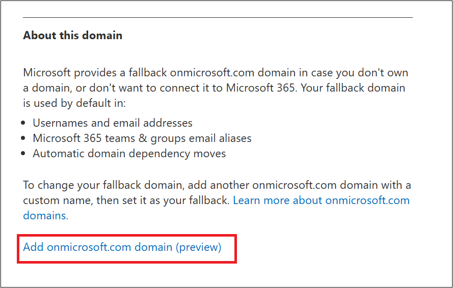
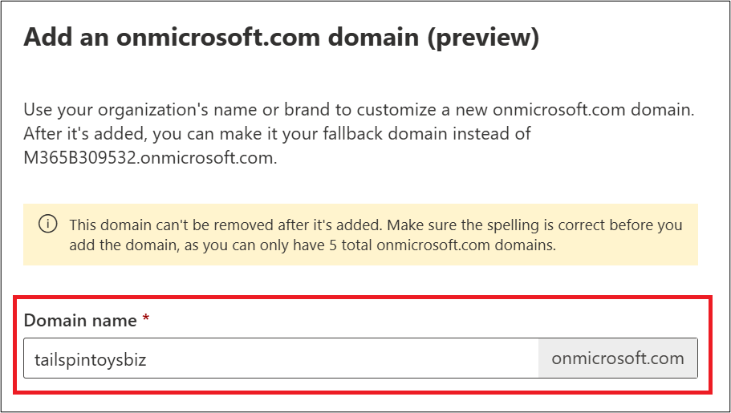
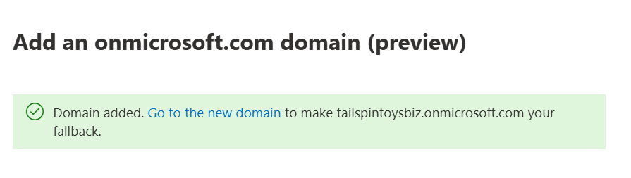

# Add a domain to Microsoft 365

Microsoft recommends using a custom domain name for your organization. Using a custom domain name can enhance your organization's email's appearance and improve its reputation. Your company might also need multiple domain names. For example, your company might have different variations of the company name. Customers might be trying to use the alternate name of your company. If you don't have the alternate spellings of your company name as a domain name, customer communications might fail to reach you.

>[!IMPORTANT]
>
> To add, modify, or remove domains, you **must** be a **Domain Name Administrator** of a [business or enterprise plan](https://products.office.com/business/office). Because these changes affect the whole tenant, *customized administrators* or *regular users* can't make these changes.

## Watch: Add a domain

Check out this video and others on our [YouTube channel](https://go.microsoft.com/fwlink/?linkid=2198213).

> [!VIDEO https://learn-video.azurefd.net/vod/player?id=23594aee-6bbd-45d0-8e89-f00fc78ca495]

## Add the first domain to Microsoft 365

To add a custom domain name for the first time to Microsoft 365, follow these steps:

1. Sign into the [Microsoft 365 admin center](https://go.microsoft.com/fwlink/p/?linkid=2024339).

1. From the left navigation bar, select [**Setup**](https://go.microsoft.com/fwlink/p/?linkid=2171997).

    > [!TIP]
    >
    > If **Setup** isn't visible in the left navigation bar, select **… Show all**, and then select **Setup**.

1. In the **Setup** page, under **Sign-in and security**, select **Get your custom domain set up**.

1. In the **Get your custom domain set up** page, select **Get Started**.

1. In the **Domain name** textbox of the **Add a domain** page, enter the new domain name that you want to add, and then select **Use this domain**.

1. In the **Verify you own your domain** page, different options are displayed depending on where your domain is registered:

   - **Domain registrar supports [Domain Connect](#domain-connect-registrars-integrating-with-microsoft-365)**

       If a domain registrar supports **Domain Connect**, Microsoft can automatically verify domain ownership. Additionally, Microsoft can also automatically add DNS records necessary for Microsoft 365 services.

       If the registrar supports **Domain Connect**, you will see **Sign in to *registrart*** where *registrar* is the name of the registrar where your domain is registered.

       To use **Domain Connect**, follow these steps:

        1. Make sure the name of the displayed registrar is correct and then select **Verify**. If your domain is registered at a different registrar than what is displayed, select **choose a different domain host**. After selecting the proper registrar, select **Verify**.

        1. A new window from your registrar opens. Sign into the registrar and then authorize for TXT DNS record to be added.

        1. Once the TXT DNS record is added and domain ownership is verified, you're returned back to the Microsoft 365 admin center window.

        1. In the **How do you want to connect your domain** page, select **Continue**.

        1. In the **Add DNS records** page, select the Microsoft 365 services that you want DNS records added for, and then select **Add DNS records**. Make sure to also expand **Advanced options** to view additional Microsoft 365 services that might need DNS records.

        1. A new window from your registrar opens showing the DNS records that are going to be added. Verify that the DNS records are correct, and then authorize the DNS records to be added.

        1. Once the DNS records are added, you're returned back to the Microsoft 365 admin center windows.

        1. The **Domain setup is complete** page displays. Select **Done** to complete adding your custom domain and DNS records to Microsoft 365.

   - **Domain registrar doesn't support [Domain Connect](#domain-connect-registrars-integrating-with-microsoft-365)**

       If a domain registrar doesn't support **Domain Connect**, domain ownership verification needs to be performed manually. Additionally, DNS records for Microsoft 365 services need to be added manually.

        > [!TIP]
        >
        > In instances where a registrar supports **Domain Connect** but automatic DNS record creation by Microsoft isn't desired, manually creating DNS records can be used instead. To manually add DNS records instead of using **Domain Connect**, select **More options** at the appropriate page, and then proceed with the steps.

        To manually verify domain ownership and manually add DNS records, follow these steps:

        1. In the **Verify you own your domain** page, select one of the following options to verify domain ownership:

           - **Add a TXT record to the domain's DNS records**.
           - **If you can't add a TXT record, add an MX record to the domain's DNS records**.
           - **Add a text file to the domain's website**.

        1. After an option is selected, select **Continue**:

        1. Instructions specific to the selected option appears:

            - The **Add a record to verify ownership** page appears if one of the following two options is selected:

              - **Add a TXT record to the domain's DNS records**.
              - **If you can't add a TXT record, add an MX record to the domain's DNS records**.

                The page contains instructions on what DNS records to add at your registrar to verify domain ownership. For detailed instructions on adding DNS records at your registrar, refer to the registrar's documentation and instructions.

                > [!WARNING]
                >
                > If using the option **If you can't add a TXT record, add an MX record to the domain's DNS records**, make sure to set the **Priority** field of the MX record to high value so that it doesn't break email with your current email provider.

            - If the **Add a text file to the domain's website** is selected, instructions appear on the **Verify you own this domain** page that explains how to add a file to your website to verify domain ownership. For detailed instructions on adding files to your website, refer to the web hosting provider's documentation and instructions.

        1. Once the selected option is completed, select **Verify**. Domain ownership verification occurs.

        1. Once domain ownership verification completes, the **How do you want to connect your domain** appears. Select **Continue**.

            > [!NOTE]
            >
            > If you select **More options** instead of **Continue**, select **Add your own DNS records**, and then select **Continue**.

        1. The **Add DNS records** page contains instructions on what DNS records need to be added at your registrar. Select the Microsoft 365 services that you need DNS records for and then expand each DNS record type for detailed information on the format of the DNS record. Make sure to also expand **Advanced options** to view additional Microsoft 365 services that might need DNS records. The DNS records then need to be manually created at the registrar. For detailed instructions on adding DNS records at your registrar, refer to the registrar's documentation and instructions.

        1. Once the DNS records are manually added at the registrar, select **Continue**.

        1. The **Domain setup is complete** page displays. Select **Done** to complete adding your custom domain and DNS records to Microsoft 365.

## Add a domain

Follow these steps to add, set up, or continue setting up a domain.

1. Sign into [Microsoft 365 admin center](https://go.microsoft.com/fwlink/p/?linkid=2024339).

1. From the left navigation bar, select **Settings**.

1. [**Domains**](https://go.microsoft.com/fwlink/p/?linkid=834818) page.

1. Select **Add domain**.

1. Enter the name of the domain you want to add, then select **Next**.

1. Choose how you want to verify that you own the domain.

    1. If your domain registrar uses [Domain Connect](#domain-connect-registrars-integrating-with-microsoft-365), Microsoft [sets up your records automatically](../get-help-with-domains/domain-connect.md) by having you sign in to your registrar and confirm the connection to Microsoft 365. You're returned to the Microsoft 365 admin center and Microsoft automatically verifies your domain.

    1. You can use a TXT record to verify your domain. Select TXT record and then select **Next** to see instructions for how to add a TXT DNS record to your registrar's website. It can take up to 10 minutes to verify after you add the record although some DNS hosting providers require up to 48 hours.

    1. You can add a text file to your domain's website. **Select** and download the .txt file from the setup wizard, then **upload** the file to your website's top-level folder. The path to the file should look similar to the following example:

        `http://mydomain.com/ms39978200.txt`

        Microsoft confirms you own the domain by finding the file on your website.

1. Choose how you want to make the DNS changes required for Microsoft to use your domain.

    1. Choose **Add the DNS records for me** if your registrar supports [Domain Connect](#domain-connect-registrars-integrating-with-microsoft-365). If the registrar does support **Domain Connect**, Microsoft [sets up your records automatically](../get-help-with-domains/domain-connect.md) by having you sign in to your registrar and confirm the connection to Microsoft 365.

    1. Choose **I'll add the DNS records myself** if you want to attach only specific Microsoft 365 services to your domain or if you want to skip it for now and manually add DNS records yourself later.

        >[!WARNING]
        >
        > Only choose this option if you know now to manually add DNS records yourself.

1. If you chose to *add DNS records yourself*, select **Next** and you see a page with all the records that you need to add to your registrars website to set up your domain.

    If the portal doesn't recognize your registrar, you can [follow these general instructions.](../get-help-with-domains/create-dns-records-at-any-dns-hosting-provider.md)

    If you don't know the DNS hosting provider or domain registrar for your domain, see [Find your domain registrar or DNS hosting provider](../get-help-with-domains/find-your-domain-registrar.md).

    If you want to wait for later, either unselect all the services and select **Continue**, or in the previous domain connection step, choose **More Options** and select **Skip this for now**.

1. Select **Finish** - you're done!

## Add or edit custom DNS records

Follow these steps to add a custom record for a website or non-Microsoft service.

1. Sign in to the [Microsoft 365 admin center](https://go.microsoft.com/fwlink/p/?linkid=2024339).

1. Go to the **Settings**  > [**Domains**](https://go.microsoft.com/fwlink/p/?linkid=834818) page.

1. On the **Domains** page, select a domain.

1. Under **DNS records**, select **Custom Records**; then select **Add record**.

1. Select the type of DNS record you want to add and type the information for the new record.

1. Select **Save**.

## Registrars with Domain Connect

Registrars that are [Domain Connect](https://www.domainconnect.org/) enabled allow you add your domain to Microsoft 365 in a three-step process that takes a few minutes.

In the wizard, Microsoft confirms that you own the domain. Once domain ownership is confirmed, Microsoft automatically sets up your domain's DNS records and the following items start to work with your domain:

- Email that comes to Microsoft 365.
- Other Microsoft 365 services, such as Teams.

> [!NOTE]
>
> Make sure you disable any popup blockers in your browser before you start the setup wizard.

### Domain Connect registrars integrating with Microsoft 365

- [Aruba.it](https://www.aruba.it/home.aspx)
- [IONOS](https://www.1and1.com/)
- [EuroDNS](https://www.eurodns.com/)
- [Cloudflare](https://www.cloudflare.com/)
- [GoDaddy (_Media Temple_)](https://www.godaddy.com/)
- [WordPress.com](https://wordpress.com/)
- [Plesk](https://www.plesk.com/)
- SecureServer or WildWestDomains (GoDaddy resellers using SecureServer DNS hosting)
  - Examples:
    - [DomainsPricedRight](https://www.domainspricedright.com/products/domain-registration)
    - [DomainRightNow](https://www.domainrightnow.com/)

### What happens to my email and website?

After you finish setup, the MX record for your domain is updated to point to Microsoft 365 and all email for your domain will start coming to Microsoft 365. Make sure you add users and set up mailboxes in Microsoft 365 for everyone who gets email on your domain!

If you have a website that you use with your business, it keeps working where it is. The Domain Connect setup steps don't affect your website.

### Add an onmicrosoft.com domain

Each Microsoft 365 organization can have up to five **onmicrosoft.com** domains.

> [!NOTE]
>
> - You must be a **Domain Name admin** to add a domain.
>
> - Creating another **.onmicrosoft.com** domain and using it as your default doesn't do a rename for Microsoft SharePoint. To make changes to your **.onmicrosoft** SharePoint domain you would need to use the [SharePoint domain rename preview](/sharepoint/change-your-sharepoint-domain-name) (currently available to any tenant with less than 10,000 sites).
>
> - If you're using Microsoft 365 mail services, removal of your initial **.onmicrosoft** domain isn't supported.

To add an **onmicrosoft.com** domain:

1. Sign in to the [Microsoft 365 admin center](https://go.microsoft.com/fwlink/p/?linkid=2024339).

1. Go to the **Settings**  > [**Domains**](https://go.microsoft.com/fwlink/p/?linkid=834818) page.

1. Select an existing *.onmicrosoft.com* domain.

    

1. On the **Overview** tab, select **Add onmicrosoft.com domain**.

    

1. On the **Add onmicrosoft domain** page, in the **Domain name** box, enter the name for your new **onmicrosoft.com** domain.

    

    > [!NOTE]
    >
    > Make sure to verify the spelling and accuracy of the domain name you entered. You're limited to five **onmicrosoft.com** domains, and currently they can't be deleted once they're created.

1. Select **Add domain**. A success message is displayed when the domain is successfully added.

    

You can set any domain you own as your default domain.

For more information on how to add an **onmicrosoft.com** domain, see [Add or replace your onmicrosoft.com domain](add-or-replace-your-onmicrosoftcom-domain.md).

## Support

[!INCLUDE [How to get tech support for SMB](../../includes/smb-how-to-get-tech-support.md)]

## Related content

- [Domains FAQ](domains-faq.yml) (article).
- [What is a domain?](../get-help-with-domains/what-is-a-domain.md) (article).
- [Buy a domain name in Microsoft 365](../get-help-with-domains/buy-a-domain-name.md) (article).
- [Add DNS records to connect your domain](../get-help-with-domains/create-dns-records-at-any-dns-hosting-provider.md) (article).
- [Change nameservers to set up Microsoft 365 with any domain registrar](../get-help-with-domains/change-nameservers-at-any-domain-registrar.md).
- [Small business help & learning](https://go.microsoft.com/fwlink/?linkid=2224585).
- [Microsoft 365 small business help](https://go.microsoft.com/fwlink/?linkid=2197659).
