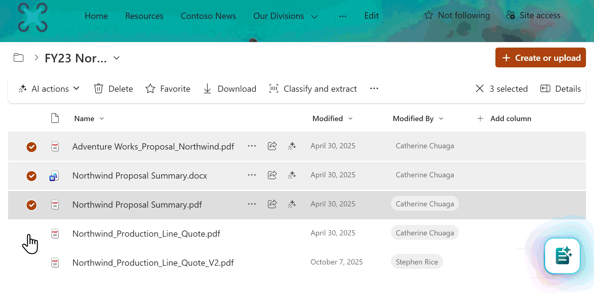
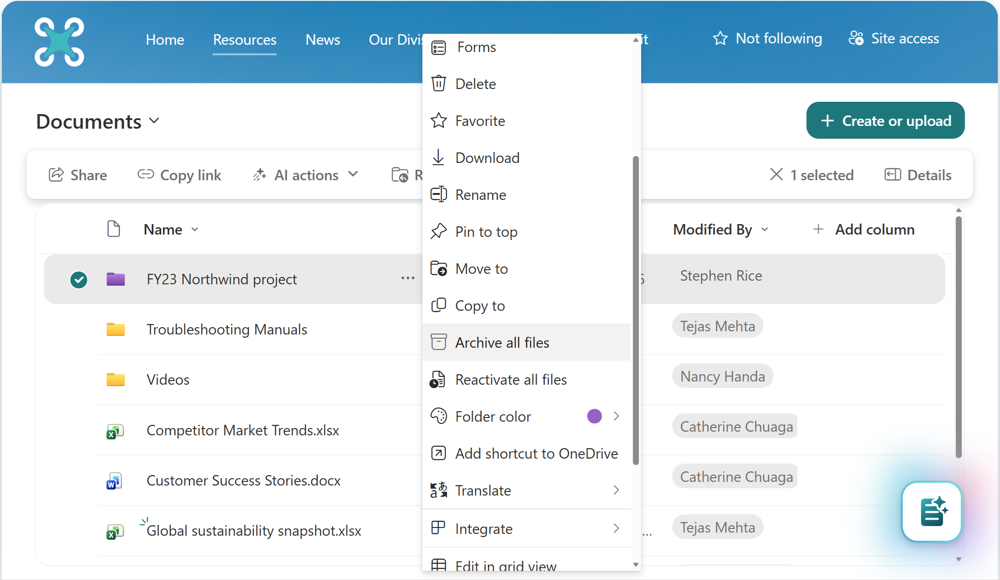

# End user experience in Microsoft 365 Archive

End users cannot directly access archived content. When a user tries to access archived content, they see a message indicating that either the site or the file is archived. If a file is archived, any user with read access can reactivate the file to regain full access. Reactivation can take up to 24 hours to complete.

---
#### File archive experience - Reactivation

End users who encounter archived files can reactivate the file by navigating to it in the SharePoint site or OneDrive account where the file is hosted. If the user has read permissions, they can reactivate the file by selecting it and invoking the '***reactivate***' action. Reactivation can take up to 24 hours to complete. The user who initiated the reactivation receives an email when the process is finished.


> [!NOTE]
> For some Microsoft 365 applications, there is no clear indicator that a file is archived. Navigating to the underlying SharePoint site or OneDrive account is the most reliable way to confirm a file's archive status and reactivate it if needed.

---

#### File archive experience - Archiving

Users with edit permissions can easily archive files on SharePoint sites that are enabled for file archiving. To archive a file, users select one or more files and invoke the '***archive***' action.



---

#### Folder-level actions
Folder-level actions let users **archive or reactivate all files within a folder**, including files in any subfolders, in a single operation. These actions apply recursively to all files within the selected folder. Folders themselves don't have an archived or active state. Users must have the appropriate permissions on the files to perform these actions.

Users with edit permissions can archive all files in a folder by using the '***Archive all files***' action. Likewise, users with read permissions can reactivate all archived files in a folder by using the '***Reactivate all files***' action.

To archive or reactivate all files in a folder, users can select the desired folder and invoke the '***Archive all files***' or '***Reactivate all files***' action.

The user will receive an email when the action is complete.




##### Limits and considerations

The following limits apply to folder-level archive and reactivation actions:

- **Site-level limit**: A maximum of **500,000 archive or reactivate actions per site per day**.

- **Folder archive limit**: A folder can contain a maximum of **20,000 items** when using **Archive all files**.

- **Folder reactivation limit**: A folder can contain a maximum of **20,000 items** when using **Reactivate all files**.

- **Reactivation time**. Scheduling a recursive reactivation typically takes about 10 minutes, but can take up to 24 hours for large folders. After scheduling, files can take up to 24 hours to reactivate. For large folders, the full process can take up to 48 hours to schedule and complete.

---
#### Site archive experience


In Microsoft 365 Archive for sites, admins have an option to set a custom URL where the user requests for reactivation can be directed to. This can take users to any URL you choose, such as a form, a ticketing system, or other location accessible via a URL. Once configured, users will see a **Request to reactivate** button when they encounter archived content.

This custom URL can be set via a flag (``-ArchiveRedirectUrl``) in the Set-SPOTenant PowerShell cmdlet starting in version 16.0.23408.12000.

```PowerShell
Set-SPOTenant -ArchiveRedirectUrl <url>
```

**Example:** Set-SPOTenant -ArchiveRedirectUrl <https://contoso.sharepoint.com/sites/ReactivateSite>

To remove the custom URL and the **Request to reactivate**  button:

```PowerShell
Set-SPOTenant -ArchiveRedirectUrl ""
```

> [!NOTE]
>For a multi-geo tenant, the URL needs to be set for each geo location.

The **Request to reactivate** button won't be visible if a redirect URL is not set.
