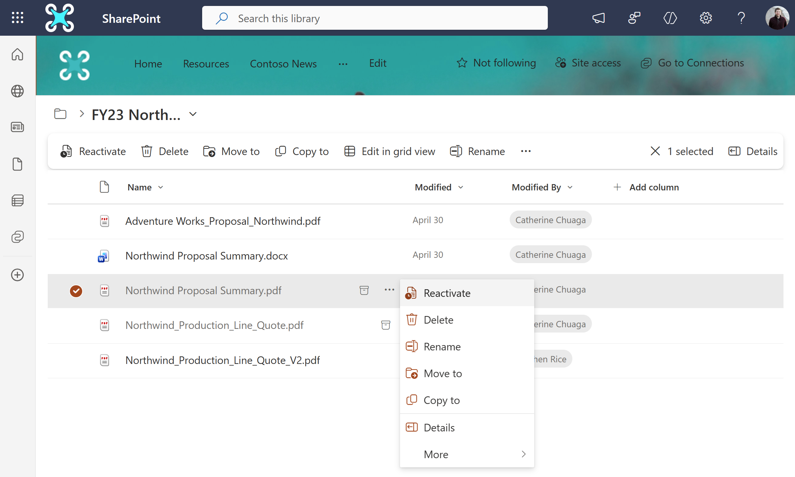

# End user experience in Microsoft 365 Archive

End users aren't able to directly access any content that has been archived. Whenever users try to access archived content, they will either see a message stating that the site has been archived or the file has been archived.  If the file has been archived, then any user with read access can reactivate the file to regain full access.  Reactivation can take up to 24 hours to complete. 

#### File archive experience

End-users who encounter archived files can reactivate the file by navigating to the file in the SharePoint site or OneDrive account where the file is hosted.  The user can reactivate by simply selecting the file and clicking the 'reactivate' button. Reactivation can take up to 24 hours to complete.



> [!NOTE]
>For some Microsoft 365 applications there isn't a clear indicator that a file has been archived. Navigating to the underlying SharePoint site or OneDrive account is the most reliable way to validate a file's archive status and reactivate the file if needed.

#### Site archive experience


In Microsoft 365 Archive for sites, admins have an option to set a custom URL where the user requests for reactivation can be directed to. This can take users to any URL you choose, such as a form, a ticketing system, or other location accessible via a URL. Once configured, users will see a **Request to reactivate** button when they encounter archived content.

This custom URL can be set via a flag (``-ArchiveRedirectUrl``) in the Set-SPOTenant PowerShell cmdlet starting in version 16.0.23408.12000.

```PowerShell
Set-SPOTenant -ArchiveRedirectUrl <url>
```

**Example:** Set-SPOTenant -ArchiveRedirectUrl <https://contoso.sharepoint.com/sites/ReactivateSite>

To remove the custom URL and the **Request to reactivate**  button:

```PowerShell
Set-SPOTenant -ArchiveRedirectUrl ""
```

> [!NOTE]
>For a multi-geo tenant, the URL needs to be set for each geo location.

The **Request to reactivate** button won't be visible if a redirect URL hasn't been set.
