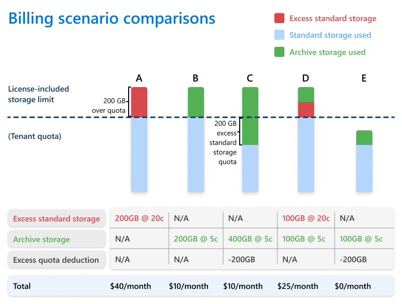

# Pricing model for Microsoft 365 Archive

Microsoft 365 Archive charges you for storage.

Storage consumption is charged at a per-GB monthly rate. This meter is charged only when archived storage plus active storage in SharePoint exceeds the included or licensed allocated SharePoint storage capacity limit of the tenant. In other words, there's no additional storage cost for archived sites or files if the tenant hasn't consumed its already licensed storage quota. For more information about storage capacity limits, see [SharePoint limits](/office365/servicedescriptions/sharepoint-online-service-description/sharepoint-online-limits).

> [!NOTE]
> The reactivation fee for archived content in SharePoint was eliminated on March 31, 2025. After that date, reactivating archived content became free of charge, but re-archiving any newly reactivated content is restricted for a four-month period. This change doesn't apply to OneDrive accounts. For more information, see the [Microsoft 365 Archive blog](https://techcommunity.microsoft.com/blog/microsoft_365_archive_blog/microsoft-365-archive-eliminates-reactivation-fees-by-march-31-2025/4383215).

Monthly archive storage usage is calculated as the total of two components: (1) the storage used by all archived SharePoint sites, and (2) the storage used by archived files that reside in non-archived SharePoint sites. Archived files that are contained within an archived site are counted only as part of that site's archived storage and are not counted again individually.

For archived sites, the billed storage is equal to the site's current storage usage, as shown on the site itself or on the **Active sites** page in the SharePoint admin center. The storage usage of an archived site changes only when the site's content changes, such as when items expire from the recycle bin or when retention policies permanently delete content.

To see the pricing for Microsoft 365 Archive, see [Pay-as-you-go services and pricing](/microsoft-365/documentprocessing/syntex-pay-as-you-go-services#storage-services).

> [!NOTE]
> If Microsoft 365 Archive is turned off, or if the associated archive billing subscription is unhealthy or turned off, archived content stays archived. Archived content can still be reactivated. New archive actions are blocked until Microsoft 365 Archive is turned on and billing is healthy. While Microsoft 365 Archive or billing is unavailable, archived content counts as active storage usage and counts toward standard Microsoft 365 storage consumption.

## Pricing calculator for site archive

The Microsoft 365 Archive pricing calculator is a tool that helps you estimate the costs that you incur to archive your Microsoft 365 data.

> [!NOTE]
> The tool isn't intended to provide an exact prediction of your archive costs, but rather to give you an estimate based estimated usage data provided by you.

### Pricing calculator overview

The Microsoft 365 Archive pricing calculator, when calculating the potential costs and savings for using Microsoft 365 Archive, takes into consideration the following heuristics:

- The active tenant storage quota, measured in terabytes (TB)

- The active storage-that is, the volume of standard storage currently in use, in terabytes (TB)

- The average archive storage expected to be consumed annually, in terabytes (TB)

- The storage cost per gigabyte/per gigabyte per month, as applicable

### Using the pricing calculator

To use the Microsoft 365 Archive pricing calculator, you need to perform the following steps. Information about how to collect data from each of these steps is detailed later in this article.

<!---
Update needed:
 The pricing calculator still includes reactivation fees.
--->

1. Download the latest version of the [Microsoft 365 Archive pricing calculator tool](https://aka.ms/Microsoft365ArchiveCostCalculator).

2. Launch the tool and provide inputs in the cells indicated in the 'Input' column.

3. Observe the estimated results in the 'Results' column.

4. Modify the inputs in the 'Input' column if you want to model a range of scenarios across input variables.

### Pricing calculator notes

When using the Microsoft 365 Archive pricing calculator, be aware of the following points:

- In the Microsoft 365 Archive pricing calculator, any Excel spreadsheet cell that is colored orange can have data entered.

## Billing scenarios

Your charges for Microsoft 365 Archive depend on your tenant's standard storage quota. The following scenarios and diagram can help you compare charges based on excess storage.

|Scenario  |Description  |Additional costs  |
|:---------:|---------|---------|
|**A**     |Tenant hasn't archived any data and exceeds the standard storage quota by 200 GB.         |Purchase 200 GB of additional standard storage packs.         |
|**B**     |Tenant has archived the 200 GB of data that exceeded their standard storage quota.         |Pay at $0.05/GB/month for 200 GB of archive storage.         |
|**C**     |Tenant has archived more storage than exceeded their standard storage quota.         |Pay only for the 200 GB of archived data that exceeds the standard storage quota.         |
|**D**     |Tenant has archived some, but not all, of the data that exceeds their standard storage quota.         |Purchase additional standard storage packs and pay $0.05/GB/month for approximately 100 GB of archived data.         |
|**E**     |Tenant's total data (standard + archive) is less than their standard storage quota.         |No additional costs.         |

## Pricing for unlicensed OneDrive accounts

 Archive storage for unlicensed OneDrive accounts is billed per GB of archived data per month. Reactivation of archived OneDrive accounts is billed per GB of reactivated data per reactivation. For more information, see [Pay-as-you-go services and pricing](/microsoft-365/documentprocessing/syntex-pay-as-you-go-services#storage-services).

> [!NOTE]
> 
> Unlicensed archived OneDrive accounts can't utilize additional SharePoint storage to bypass archive costs. For more information, see [Manage unlicensed OneDrive user accounts](/SharePoint/unlicensed-onedrive-accounts#frequently-asked-questions).

 

For EDU tenants, pooled storage is applied. For more information, see [Education offering for Microsoft 365 Archive](./archive-education-offering.md).
