---
# Required metadata
# For more information, see https://learn.microsoft.com/en-us/help/platform/learn-editor-add-metadata
# For valid values of ms.service, ms.prod, and ms.topic, see https://learn.microsoft.com/en-us/help/platform/metadata-taxonomies

title: Scale a pilot to your frontline organization
description: Scale a pilot to your frontline organization
author:      arnavgupta49 # GitHub alias
ms.author: arnavgupta
manager: viseshag
ms.service: microsoft-365-frontline
ms.topic: install-set-up-deploy
ms.date:     04/13/2026
---

# Scale a pilot to your frontline organization

> [!NOTE]
> This feature is currently in private preview. If you are interested in trying this feature out, please [sign up here](https://forms.cloud.microsoft/r/Q0xhM3KUBG).

## Overview

Confidently deploy and manage a standardized Microsoft Teams experience to your entire frontline organization from the Teams admin center. You can start a new deployment or expand an existing [frontline pilot](startafrontlinepilot.md) to your broader organization in a single, guided wizard in the **Frontline** section of the Teams admin center. Use the wizard to select capabilities, add your frontline workers, organize your frontline workforce into static teams, and set a standardized pinned app configuration for all your frontline workers.

[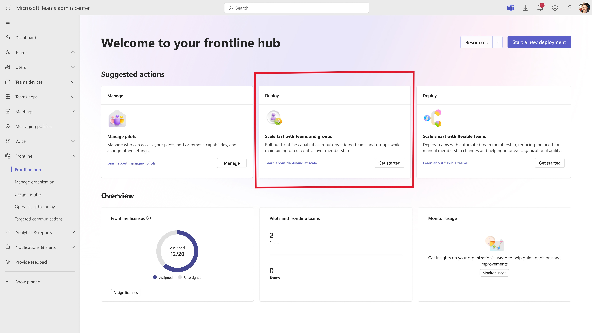](media/deployteamsatscale/frontline-hub-entry.jpg#lightbox)

Use this feature to:

- **Extend a pilot to your frontline workforce.** If you have already validated a [frontline pilot](startafrontlinepilot.md), extend it directly to your broader organization. Your capability configurations carry forward automatically so you can build on what you have already tested.
- **Create and manage a single pinned app configuration.** Define one standardized pinned app configuration that applies uniformly to all frontline workers across every team and group in your deployment. When you update your pinned apps, the change takes effect for everyone automatically.
- **Organize your frontline workforce into teams.** Create static frontline teams organized by location or business unit, either by uploading a CSV file with your workforce data or by adding teams one at a time.
- **Manage your deployment from one place.** After deployment, use the **Manage organization** section under **Frontline** in the Teams admin center to add more teams or groups, update pinned apps organization-wide, and manage team membership.
- **Track adoption.** Visit the **Usage insights** section under **Frontline** in the Teams admin center to measure activity across all your frontline workers and teams.

## Before you begin

1. Confirm you have the Teams admin role.
2. (Optional) [Launch a pilot](startafrontlinepilot.md) to a subset of your frontline workers to validate Microsoft Teams capabilities and measure readiness for a successful organization-wide rollout. Once you are ready, you can extend your pilot configurations to your entire frontline workforce.
3. Decide if you want to organize your frontline workers into teams.
   - If you want to create frontline teams, identify which teams you want to deploy and their members and owners. If you would like to create teams in bulk, prepare to upload a CSV file with a list of usernames, team names, and user types (Member or Owner).
   - If you are not ready to create frontline teams, you will need to add a Microsoft 365 group that includes all the frontline workers in your organization who should receive a standardized pinned app configuration.

## How it works

You can deploy a standardized Teams experience to your frontline workforce by either starting a new deployment from the Frontline hub or [extending a frontline pilot](#extend-a-frontline-pilot).

### Starting a new deployment

Go to Teams admin center > **Frontline** > **Frontline hub**, then select **Scale fast with teams and groups** under **Suggested actions**. Alternatively, choose **Start a new deployment** in the upper-right corner and select **Scale fast with teams and groups**.

#### Step 1: Select capabilities

Select the capabilities to include in your deployment. Apps under **You will get** are pinned to the Teams app bar. Apps under **Available apps** are not pinned unless selected. Select an app under either list to learn more about what the capability offers. After you complete the wizard, you can configure and pin additional apps.

[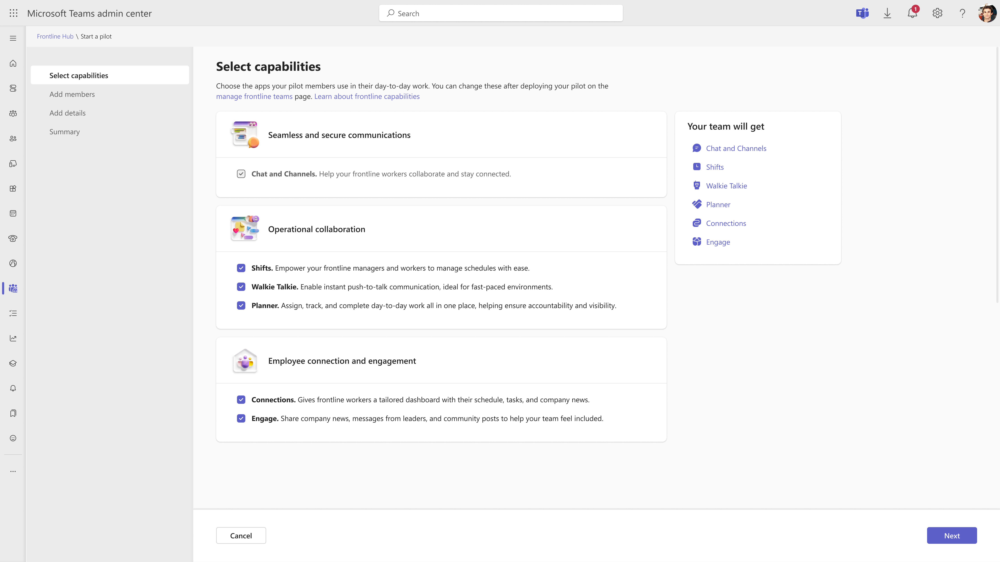](media/deployteamsatscale/select-scale-capabilities.png#lightbox)

#### Step 2: Add frontline workers

Choose how to add frontline workers to your deployment.

- **Add frontline workers through new teams** (Recommended): Create static teams for your frontline workers. This is recommended if you are rolling out apps like Channels, Shifts, Walkie Talkie, or Planner that rely on team-based collaboration.
- **Add frontline workers through existing groups**: Add a Microsoft 365 group that includes all your frontline workers who should receive your selected capabilities without being organized into separate teams.

[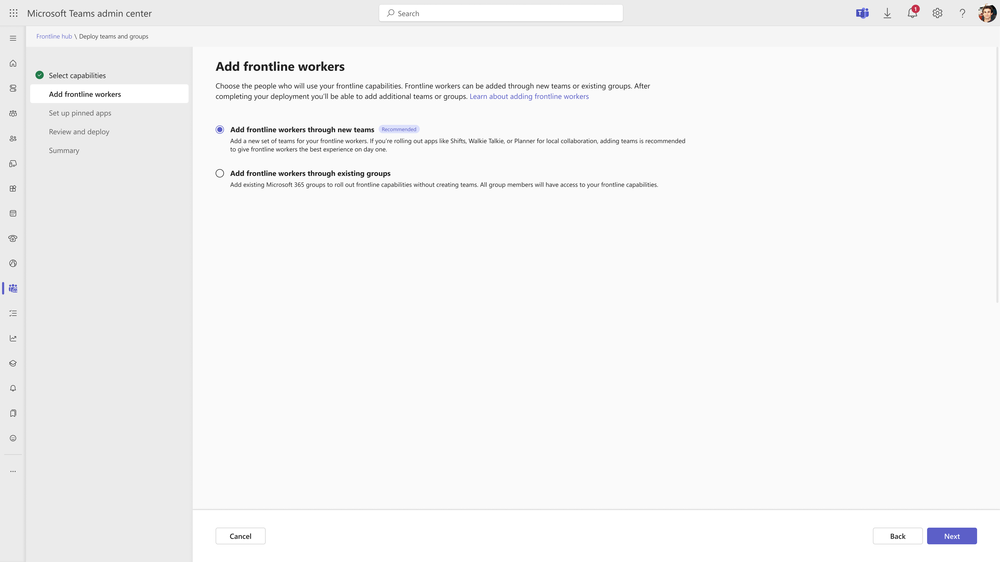](media/deployteamsatscale/add-scale-frontline-workers.jpg#lightbox)

**Add frontline workers through new teams**

On the **Add teams** page, use the **Choose how you'd like to add teams** dropdown to select your preferred method. You can add teams one at a time or upload a CSV file to add teams in bulk. Teams you add will not be deployed until you complete the full wizard.

[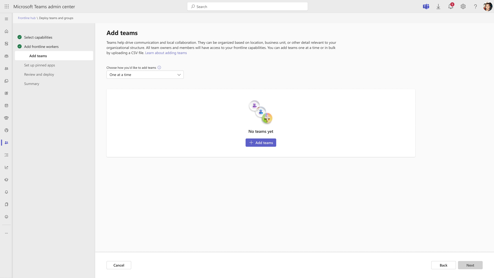](media/deployteamsatscale/choose-add-teams.png#lightbox)

> [!IMPORTANT]
> Switching between manual entry and CSV upload after you have started adding teams will remove any teams you previously added.

*Add teams one at a time*

1. Select **+ Add teams**.
2. For each team you want to create, specify a **Name**, **Description** (optional), **Team owners**, and **Team members** in the panel that opens.

   [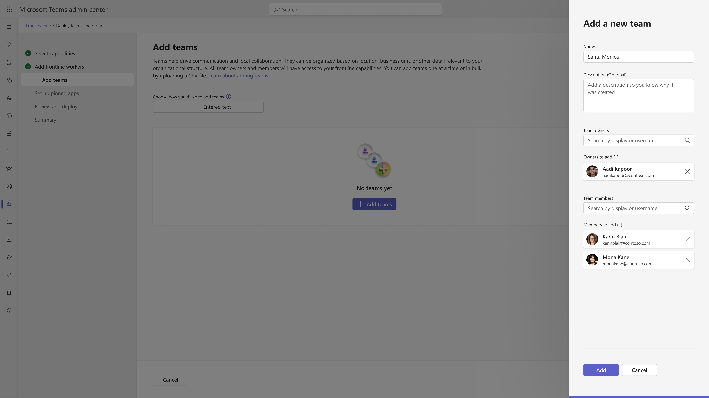](media/deployteamsatscale/add-team-side-pane.png#lightbox)

3. Select **Add**. The team appears in the table on the **Add teams** page.
4. Repeat for each team you want to add. Select **Next** when you are done.

*Upload a CSV file*

1. Select **Download CSV template** from the panel, which includes column headers for **Username**, **Team name**, and **Type**.

   [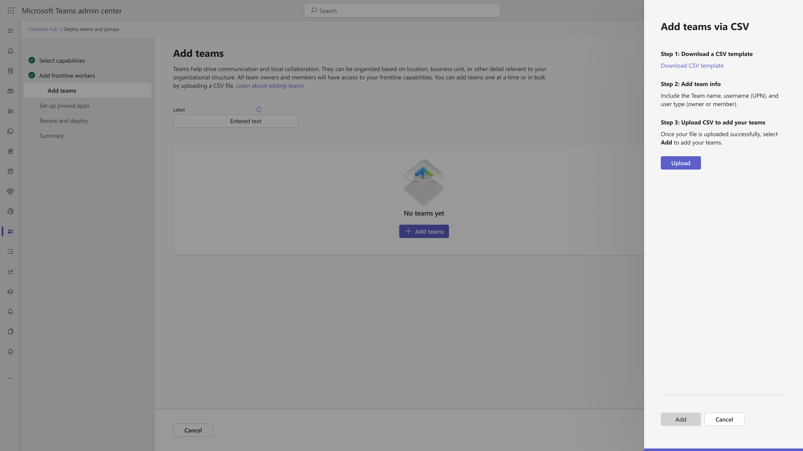](media/deployteamsatscale/add-teams-with-csv.png#lightbox)

2. Fill in the template with the user's email address under **Username**, a name for your team under **Team name**, and the user's membership type of either **Owner** or **Member** under **Type**.
3. Select **Add** to process the CSV. No teams are created until you submit the entire wizard at the end.
4. Review the preview table to confirm your data loaded correctly.
5. Select **Next** to continue.

> [!IMPORTANT]
> Each row represents one user-team assignment. To add someone to multiple teams, include a separate row for each team. Each team must have at least one owner.

**Add frontline workers through existing groups**

Search for and add a Microsoft 365 group whose members should receive your frontline capabilities. No capabilities are applied to added groups until you submit the wizard at the end.

[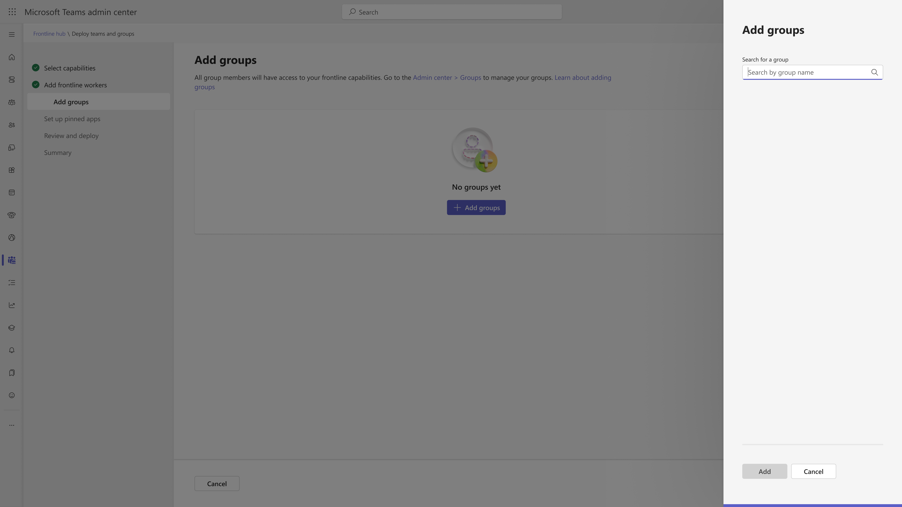](media/deployteamsatscale/add-groups.png#lightbox)

> [!NOTE]
> Members added through existing groups receive your frontline capabilities but are not organized into specific teams. If your deployment includes apps like Shifts or Walkie Talkie, consider using the new teams option to give workers the best experience.

#### Step 3: Set up pinned apps

On the **Set up pinned apps** page, configure which apps appear in the Teams mobile app bar for your frontline workers and in what order. This will be your standardized pinned app configuration for all your frontline workers, including users you may add later.

[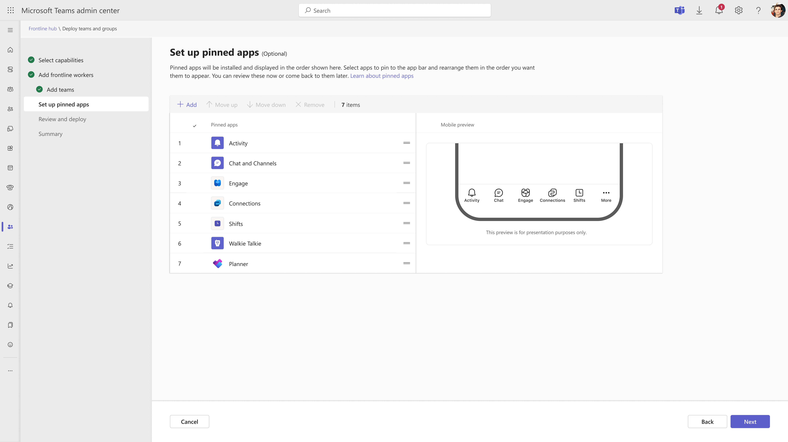](media/deployteamsatscale/wizard-pinned-apps.png#lightbox)

You can make the following changes to the pinned apps. (If you do not wish to make any changes, click **Next**.)

- Reorder pinned apps by dragging the **=** icon, or by selecting an app and choosing **Move up** or **Move down**.
- Add more apps via **Add** (top left of the table), including third-party apps.
- Unpin an app by selecting it and choosing **Remove**.

The **Mobile preview** panel on the right updates as you make changes, showing how the app bar will appear to your frontline workers on a mobile device.

Select **Next** to continue.

> [!NOTE]
> The mobile preview is for representation purposes only. After deployment, you can update your standardized pinned app configuration at any time from **Frontline** > **Manage organization** > **Deployments** > **Settings** > **Apps**.

#### Step 4: Review and deploy

The **Review and deploy** page summarizes your teams and app configuration before you commit to deployment.

[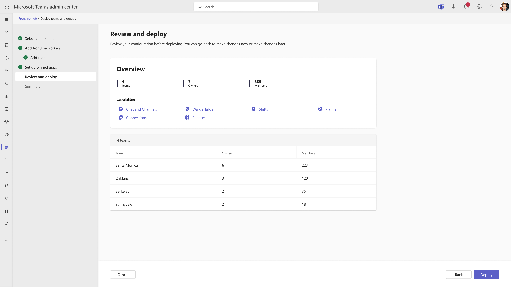](media/deployteamsatscale/review-and-deploy.png#lightbox)

The **Overview** card shows:

- The number of teams or groups in your deployment
- The number of owners and members if you are deploying teams
- The capabilities you selected

A table below the card lists each team with its owner and member counts, or each group with its name and ID.

Review all settings, then select **Deploy** to start the deployment. Select **Back** to return to a previous step and make changes.

> [!NOTE]
> Teams may take up to 30 minutes to create. Pinned app configurations may take up to 24 hours to appear in the Teams client for your frontline workers.

#### Step 5: Summary and share

A blue banner at the top of the page confirms that deployment is in progress. Select **Check deployment status** to navigate to **Frontline** > **Manage organization** > **Deployments** to check the latest status of your deployment.

[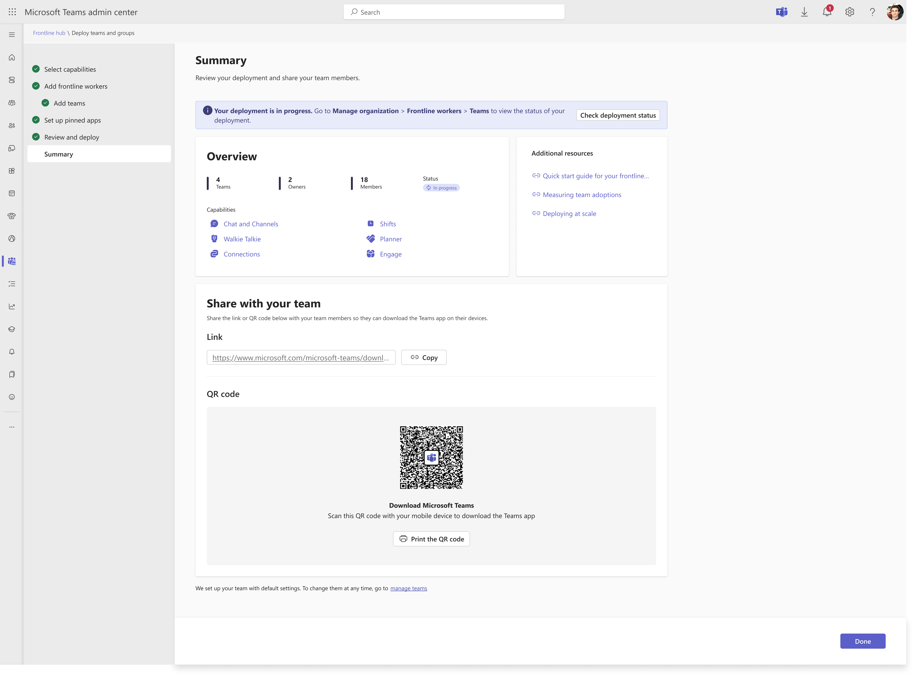](media/deployteamsatscale/summary-and-share.png#lightbox)

Share the download link or QR code with your frontline workers so they can download Teams. After they sign in, users see the deployed Teams experience with the selected pinned apps. Select **Done** to close the wizard.

### Extend a frontline pilot

If you have already run a [frontline pilot](startafrontlinepilot.md) and are ready to expand it to your broader organization, extend it from the **Pilots** page.

1. In the Teams admin center, go to **Frontline** > **Manage organization**.
2. Select the **Pilots** tab.
3. Select the pilot you want to extend.
4. In the pilot detail view, select **Extend** in the upper-right corner.

   [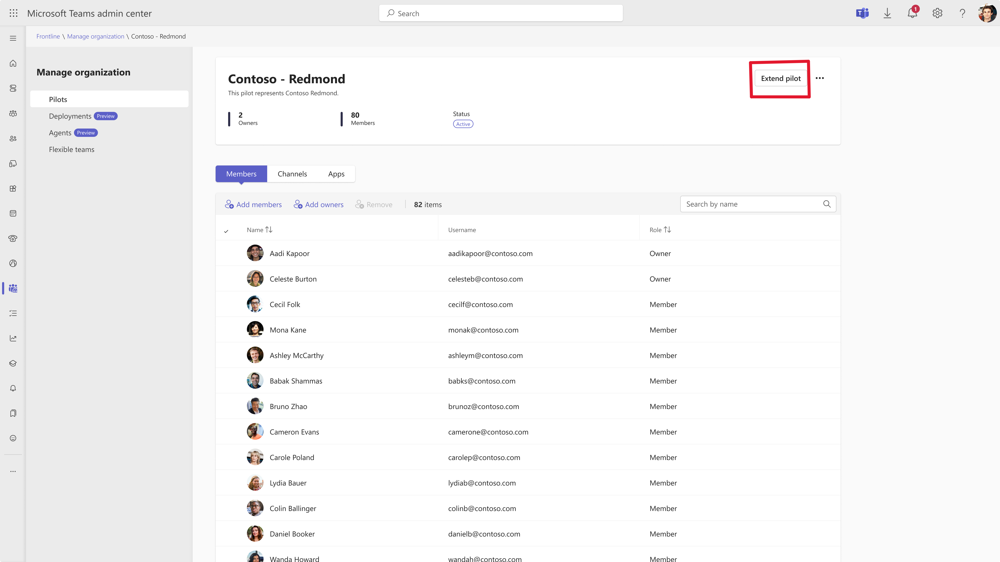](media/deployteamsatscale/extend-pilot-entry-point.png#lightbox)

5. Review the capabilities from your pilot, then select **Extend pilot**. The listed frontline capabilities become the standardized pinned app configuration for your future deployments and can be edited later from **Frontline** > **Manage organization** > **Deployments** > **Settings** > **Apps**.

   [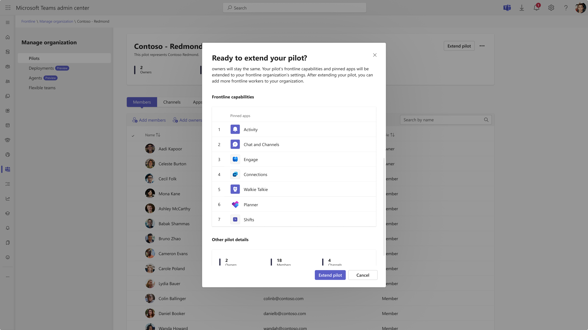](media/deployteamsatscale/extend-pilot-review-screen.png#lightbox)

6. To extend the pinned app configuration to more frontline workers, select **Add frontline workers**. The wizard opens on the **Add frontline workers** step. The **Select capabilities** step is skipped because your pilot's capability configuration carries forward automatically. Follow the same instructions from above to **Add frontline workers** and complete the wizard.

> [!NOTE]
> Your pilot's pinned app order is pre-populated in the **Set up pinned apps** step. You can adjust it before you deploy.

## Manage your deployment

Go to **Frontline** > **Manage organization** > **Deployments** to manage your frontline deployment. The **Deployments** page has two tabs: **Frontline workers** and **Settings**.

### Frontline workers

Manage your frontline teams and groups from the **Frontline workers** tab. If you organized your frontline workers into teams, view your deployed static frontline teams on the **Teams** sub-tab. If you added a group that represents all your frontline workers, view it under the **Groups** sub-tab.

#### Manage Teams

The **Teams** sub-tab lists all teams created as part of your deployment, showing the team name and deployment date. If you did not create teams in your initial deployment, you can still add static frontline teams at any time by selecting **Add teams**.

[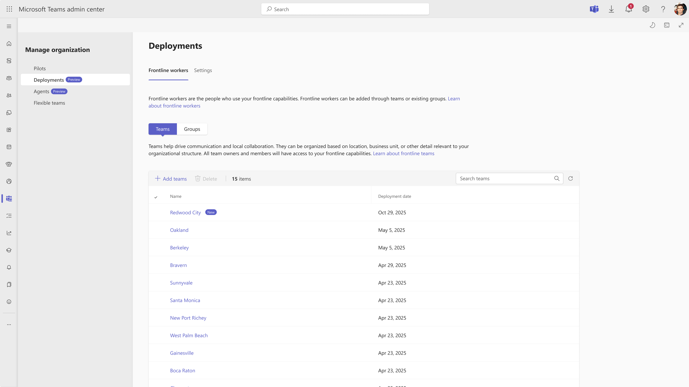](media/deployteamsatscale/static-frontline-teams-view.png#lightbox)

Each team in your deployment may show one of the following statuses:

- **New/Active**: The team's deployment recently completed. Owners and members see the frontline experience in Teams.
- **In progress**: Deployment is still processing. Refresh the page to check for updates.
- **Failed**: Deployment did not complete due to an error. Select **Retry** or download the error CSV to view the errors. Fix any errors and try deploying again.

From the toolbar, you can:

- **Add teams**: Create new frontline teams.
- **Delete**: Remove one or more selected teams.
- Use the search box to filter the list by team name.

**Add teams**

After your initial deployment is complete, you can deploy more teams at any time from the **Teams** sub-tab using a simplified wizard.

1. Go to **Frontline** > **Manage organization** > **Deployments**.
2. On the **Frontline workers** tab, select the **Teams** sub-tab.
3. Select **+ Add teams**.
4. On the **Add teams** page, add teams one at a time or in bulk via CSV, the same as during your initial deployment. No teams are deployed until you select **Deploy**.

   [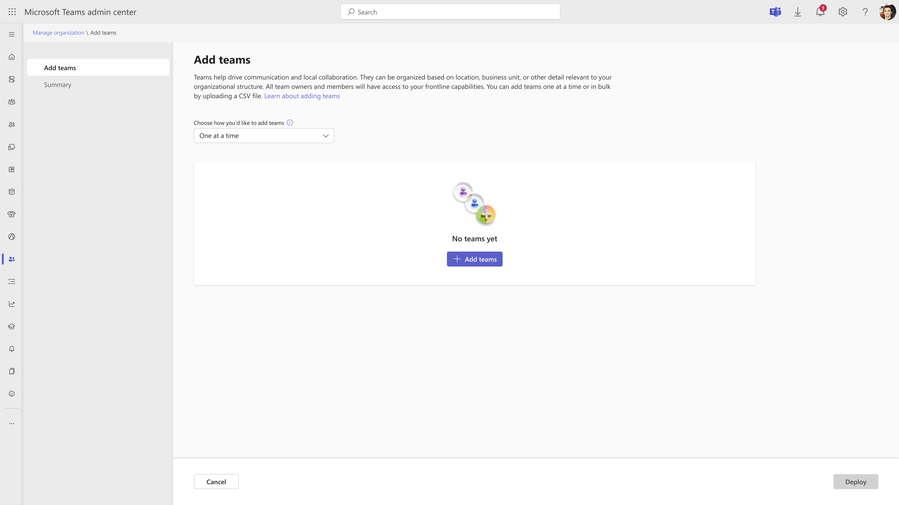](media/deployteamsatscale/add-teams-simple-wizard.png#lightbox)

5. When you are ready, select **Deploy**.

The new teams inherit the standardized pinned app configuration set in **Frontline** > **Manage organization** > **Deployments** > **Settings** > **Apps**. A **Summary** page appears when deployment begins. Select **Done** to close the wizard.

**Team detail view**

Select a team to open its detail view. The detail view shows the team name, description, number of owners, number of members, and current status. Select **...** for options to **Share**, **Edit name**, or **Delete team**.

[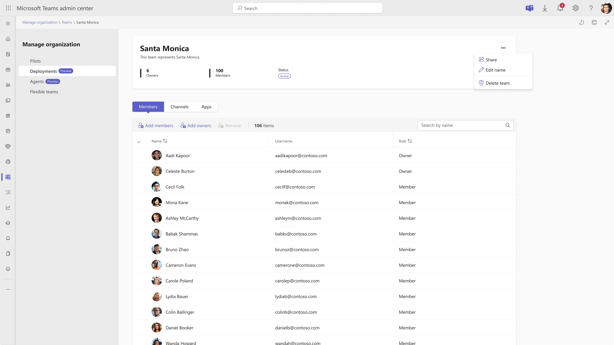](media/deployteamsatscale/team-detailed-view.png#lightbox)

Select **Add members** or **Add owners** on the **Members** tab to add frontline workers or owners to the team. Select users and choose **Remove** to remove the selected members or owners from the team. View channels on the team on **Channels** tab and view the pinned apps on the team in the **Apps** tab. You cannot edit Channels or apps for a specific team.

#### Manage groups

Add, remove, or view the groups that include all your frontline workers from the **Groups** sub-tab. Members of added groups inherit the standardized pinned app configuration set in **Frontline** > **Manage organization** > **Deployments** > **Settings** > **Apps**. Members of removed groups revert to their previous pinned app configuration.

[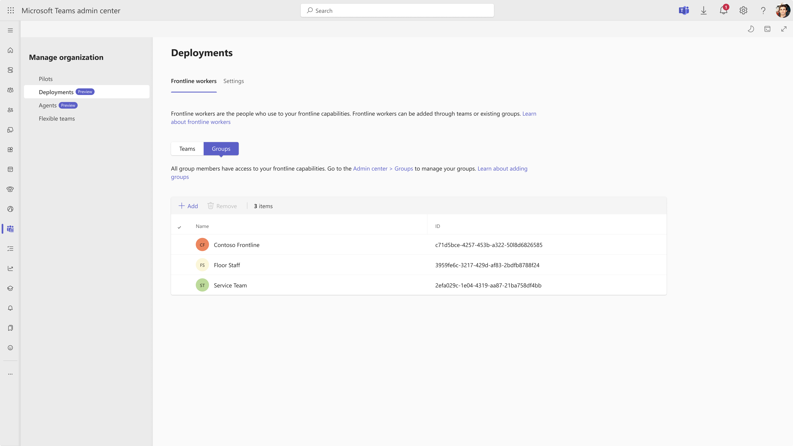](media/deployteamsatscale/manage-frontline-groups.png#lightbox)

> [!NOTE]
> Group membership is managed outside the Teams admin center. To add or remove members from a group, use the Microsoft 365 admin center.

### Manage settings

The **Settings** tab is where you manage your organization's pinned app configuration centrally, in one place. When you update pinned apps here, the change applies to all frontline workers across every team and group in your deployment. You do not need to configure pinned apps individually for each team.

[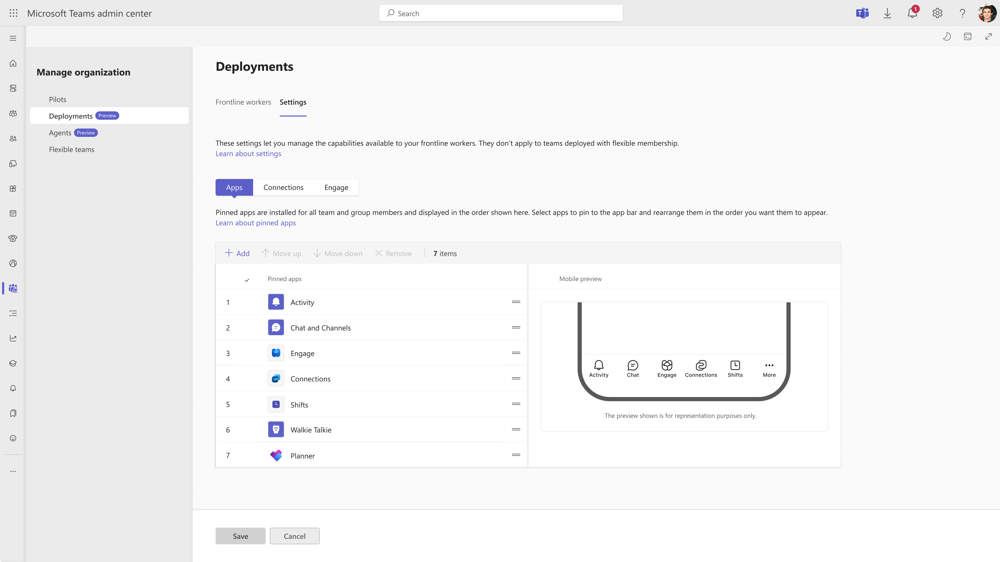](media/deployteamsatscale/manage-pinned-apps.png#lightbox)

Go to **Frontline** > **Manage organization** > **Deployments** > **Settings** > **Apps**. The table lists the apps that are currently pinned for your frontline workers. Use the following actions to manage the configuration:

- Reorder pinned apps by dragging the **=** icon, or by selecting an app and choosing **Move up** or **Move down**.
- Add more apps via **Add** (top left of the table), including third-party apps.
- Unpin an app by selecting it and choosing **Remove**.

The **Mobile preview** panel on the right updates as you make changes, showing how the app bar will appear to your frontline workers on a mobile device.

Select **Save** to confirm your changes.

> [!NOTE]
> The **Apps** tab in the individual team detail view shows a read-only view of the current pinned app configuration. To make changes, always use the **Settings** > **Apps** tab. Channel management is not available in this release and will be added in a future update.

## Merge a pilot into your deployment

After you have a full-scale deployment with a central pinned app configuration in place, you can merge any remaining pilots into that deployment. Merging converts a pilot's team into a deployed team that follows your organization's centrally managed pinned app settings.

> [!NOTE]
> The **Merge pilot** option appears only when a deployment with a central configuration already exists. If no deployment exists yet, you see **Extend pilot** instead.

[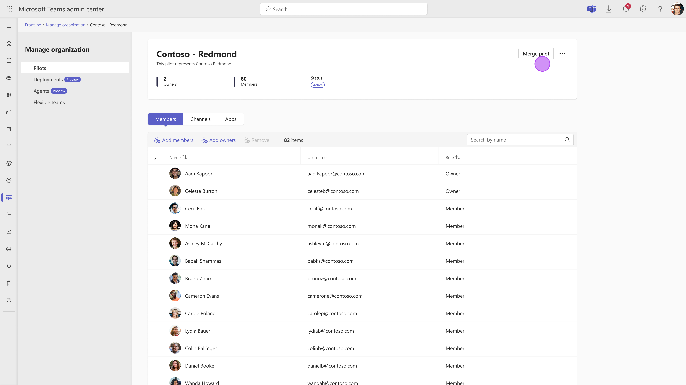](media/deployteamsatscale/merge-pilot.png#lightbox)

1. Go to **Frontline** > **Manage organization** > **Pilots**.
2. Select the pilot you want to merge.
3. Select **Merge pilot** in the upper-right corner of the pilot detail view.
4. In the **Ready to merge your pilot?** dialog, review the **Frontline capabilities** list. This list shows the pinned apps the pilot will inherit from your organization's central settings. Apps labeled **(Added via organization settings)** will be added to the pilot on merge. Apps listed under **Removed via organization settings** will be removed.

   [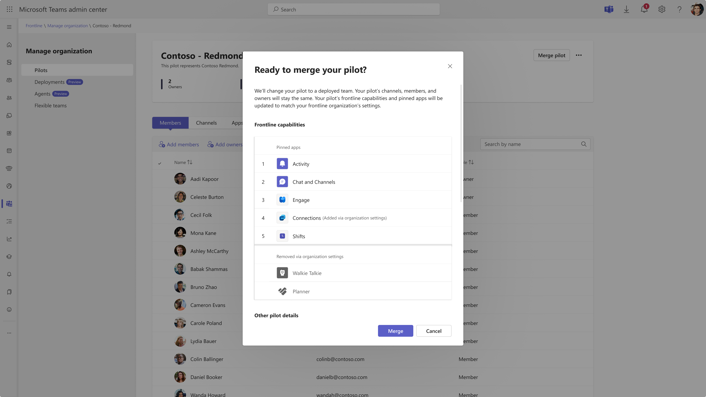](media/deployteamsatscale/review-merge-pilot.png#lightbox)

5. Select **Merge** to confirm.

After the merge, the pilot's members retain access to all teams, channels, and content. Their app bar updates to reflect the organization's standardized pinned app configuration.

## Frequently asked questions

**Q: What is the difference between adding frontline workers through new teams and through existing groups?**

**A:** Adding workers through new teams creates static teams for local collaboration using Microsoft Teams apps like Channels, Shifts, Walkie Talkie, and Planner. Adding workers through existing groups gives all group members access to your frontline capabilities without organizing them into teams. Choose teams if your frontline workers need to collaborate within a specific team context.

**Q: What is the difference between Extend pilot and Merge pilot?**

**A:** **Extend pilot** is used when no full-scale deployment exists yet. It opens the deployment wizard and carries forward your pilot's capability configuration. **Merge pilot** is used after a full-scale deployment with a central configuration is already in place. It converts the pilot's teams into deployed teams that follow your organization's centrally managed pinned app configuration.

**Q: Can I update pinned apps for all my frontline workers at once?**

**A:** Yes. Go to **Frontline** > **Manage organization** > **Deployments** > **Settings** > **Apps** to manage pinned apps centrally for all frontline workers and teams in your deployment. Changes you make here apply to everyone without requiring per-team configuration.

**Q: Can I add more teams or groups after the initial deployment?**

**A:** Yes. Go to **Frontline** > **Manage organization** > **Deployments**, select the **Teams** sub-tab, and select **+ Add teams** to launch the simplified wizard and add more teams at any time. To add more groups, select the **Groups** sub-tab and select **+ Add**.

**Q: Can I add someone to more than one team using CSV upload?**

**A:** Yes. Include a separate row for each team you want to assign the person to, using the same username with a different team name for each row.

**Q: What happens if a team fails to deploy?**

**A:** The team shows a **Failed** status in the **Teams** list. Download the error CSV to view the errors, make any necessary changes, and retry the deployment.

**Q: What happens if I delete a team?**

**A:** Deleting a team removes it from the deployment and from Microsoft Teams. Members lose access to the team and its content. This action cannot be undone. The users are not deleted from your organization.

