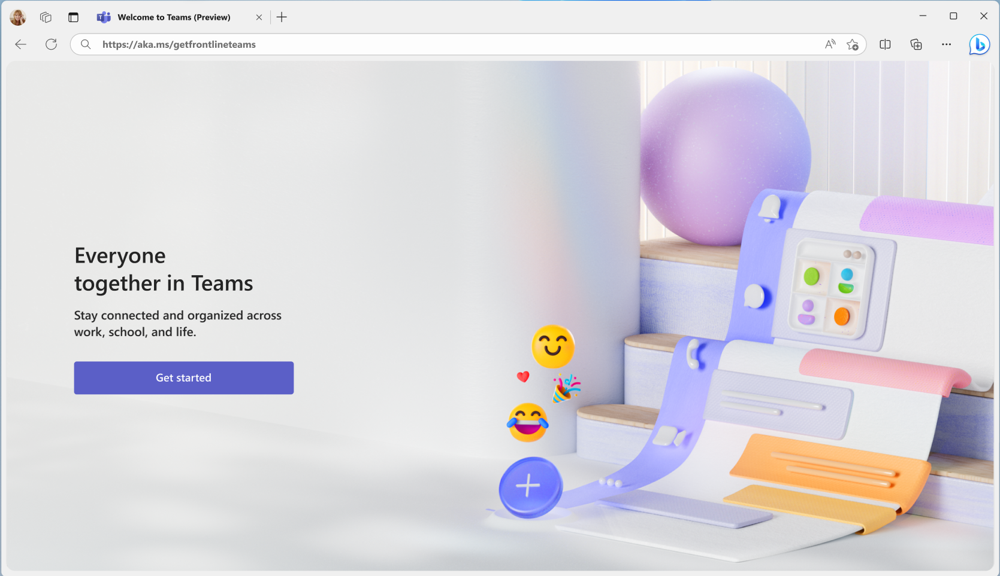

---
# Required metadata
# For more information, see https://learn.microsoft.com/en-us/help/platform/learn-editor-add-metadata
# For valid values of ms.service, ms.prod, and ms.topic, see https://learn.microsoft.com/en-us/help/platform/metadata-taxonomies

title: setup-frontline-teams-on-personal-devices
description: setup-frontline-teams-on-personal-devices
author:      aaglick # GitHub alias
ms.author:   aaglick # Microsoft alias
ms.service: microsoft-365-frontline
ms.topic: article
ms.date:     10/31/2025
---

# Setup frontline teams on personal devices (BYOD)

#### Note feature is currently in public preview. For updates please refer to the roadmap.

# Overview

The frontline Teams onboarding experience helps your frontline workers set up Teams on their personal device. This onboarding experience is available on the web with intended use on desktop kiosk or shared PC on site. The steps in the wizard will update dynamically based on the security policies defined in your organization. If your policies change over time, the wizard will adapt to those changes.

# Scenarios supported

- You want to setup Microsoft Teams on a personal device. Devices supported include Android and iOS.

- MFA is enforced to access Teams on a personal device. Note we are optimizing for setup of Authenticator push notifications as the primary MFA method.

- App protection or configuration policies are enforced to access Teams on a personal device.

# Before You Begin

Make sure you have:

- Your work username and password.

- Access to a desktop kiosk or shared PC.

- Your mobile phone

# Step 1: Start Onboarding

1. On the desktop kiosk or back-office PC, open a web browser and go to aka.ms/getfrontlineteams

   
   
1. Choose your device

1. Sign in with your work credentials

1. Reset your default password if prompted.

# Step 2: Download Required Apps

Based on your company security policies you may need to download additional apps like Microsoft authenticator and/or company portal. Below we will cover the different scenarios you may encounter:

#### Multifactor authentication (MFA)

1. You don’t require MFA to access Teams.  

   1. MFA setup is skipped
   
1. You require MFA to access Teams and you already have an MFA method setup. 

   1. MFA setup is skipped
   
1. You require MFA to access Teams and the web is experience is being accessed from a device that doesn’t require MFA

   1. Scan the QR code with your mobile phone to download the Authenticator app
   
   1. Open the app and allow notifications
   
   1. Sign withy our work account and complete setup
   
   1. Come back and select next
   
1.  You require MFA to access Teams and the web is experience is being access on a device that requires MFA

1. Follow the screens to setup MFA with the Authenticator app in the wizard

#### App protection policies and/or app configuration policies

1. If your company uses app protection and/or app configuration policies with Microsoft Teams the you might need company portal on your device.  

   1. If you have an iOS device you will not see this step
   
   1. If you have an Android device you will see this screen to download company portal
   
#### Download Microsoft Teams

1. Next you will see the screen to download Microsoft Teams. Scan the QR code with your mobile phone to download Microsoft Teams and sign in.

# Troubleshooting

- If QR code doesn’t work, manually search for each app on your phone in the app store.

# FAQ

Q: What if I’m required to enroll my devices to access Teams on my personal device?

A: The wizard will not guide you through enrollment process. Please follow the steps on your mobile phone.

