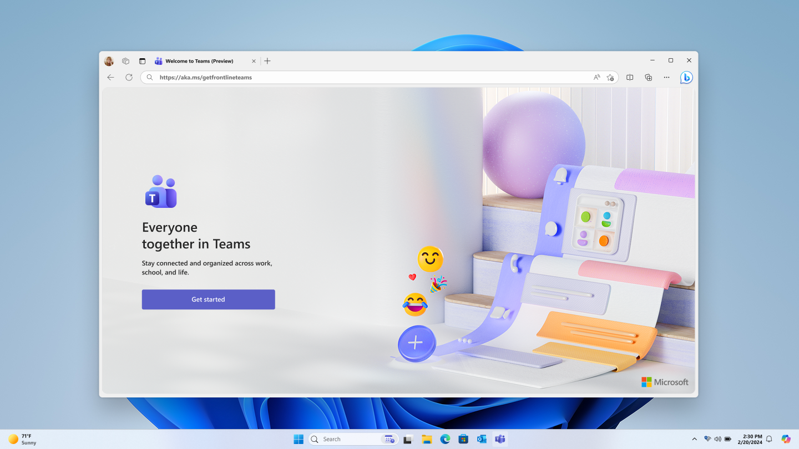
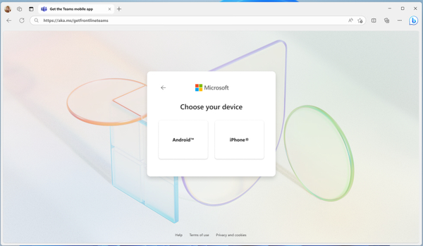
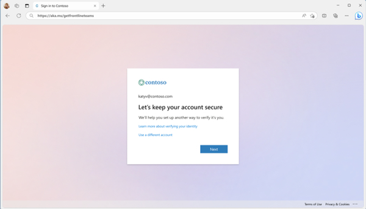
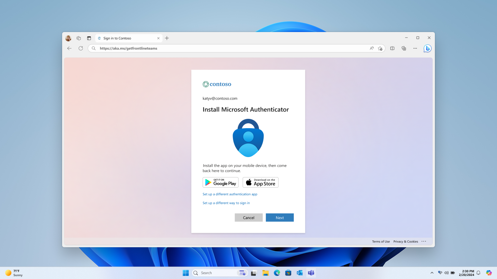
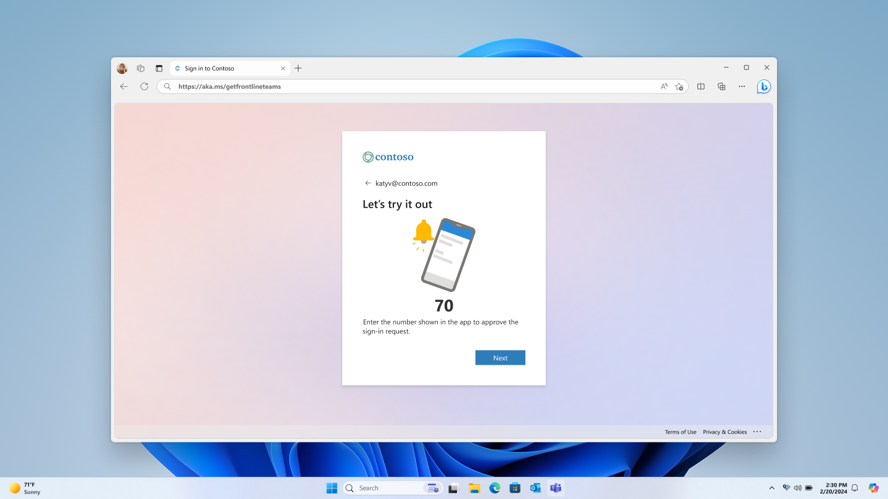
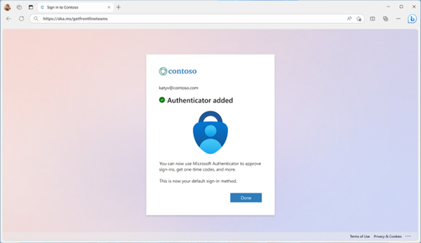
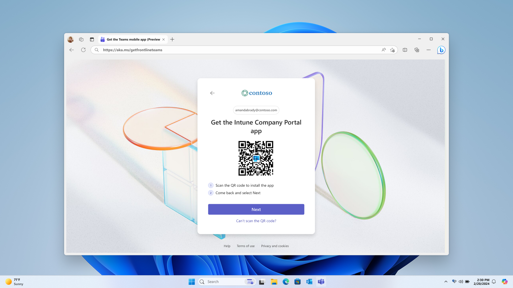

---
# Required metadata
# For more information, see https://learn.microsoft.com/en-us/help/platform/learn-editor-add-metadata
# For valid values of ms.service, ms.prod, and ms.topic, see https://learn.microsoft.com/en-us/help/platform/metadata-taxonomies

title: setup-frontline-teams-on-personal-devices
description: setup-frontline-teams-on-personal-devices
author:      aaglick # GitHub alias
ms.author:   aaglick # Microsoft alias
ms.service: microsoft-365-frontline
ms.topic: article
ms.date:     10/31/2025
---

# Setup frontline teams on personal devices

> [!NOTE]
> This feature is currently in public preview. For updates, please refer to the [Microsoft 365 roadmap](https://www.microsoft.com/microsoft-365/roadmap?id=523213). 

## Overview

The frontline Teams onboarding experience helps frontline workers set up Teams on their personal devices. This onboarding experience is available on the web and is intended for use on a desktop kiosk or shared PC at your work site. The steps in the wizard update dynamically based on the security policies defined in your organization. If your policies change over time, the wizard adapts automatically.

## Scenarios supported

- You want to set up Microsoft Teams on a personal device. Supported devices include Android and iOS.

- MFA is required to access Teams on a personal device. The wizard optimizes for setting up Authenticator push notifications as the primary MFA method.

- App protection or configuration policies are enforced to access Teams on a personal device.

## Before You Begin

Make sure you have:

- Your work username and password

- Access to a desktop kiosk or shared PC

- Your mobile phone

## Step 1: Start Onboarding

On the desktop kiosk or back-office PC, open a web browser and go to aka.ms/getfrontlineteams

Choose your device

Sign in with your work credentials

Reset your default password if prompted.

## Step 2: Download Required Apps

You may need to download additional apps such as Microsoft Authenticator and/or Company Portal based on your organization’s security policies. Below are the scenarios you may encounter:

#### Multifactor authentication (MFA)

1. You don’t require MFA to access Teams.  

   1. MFA setup is skipped
   
1. You require MFA to access Teams and you already have an MFA method setup. 

1. MFA setup is skipped
   
   You require MFA to access Teams and the web is experience is being accessed from a device that doesn’t require MFA

   
   
   1. Scan the QR code with your mobile phone to download the Authenticator app
   
1. Open the app and allow notifications
   
1. Sign withy our work account and complete setup
   
1. Come back and select next
   
1. You require MFA to access Teams and the web is experience is being access on a device that requires MFA

   1. Follow the on-screen steps to set up MFA with the Authenticator app in the setup experience.
   
      
      
      
      
      
      
      
      
      
      
      
      
      
      
#### App protection policies and/or app configuration policies

1. If your organization uses app protection and/or app configuration policies with Microsoft Teams, you might need the Company Portal app on your device.

   1. If you have an iOS device, you won’t see this step.
      
   1. If you have an Android device, you’ll see a screen to download Company Portal.  
   
      
      
#### Download Microsoft Teams

Next, you’ll see a screen to download Microsoft Teams.

- Scan the QR code with your mobile phone to download Microsoft Teams.

- Sign in and click Done when finished.

## Troubleshooting

- If the QR code doesn’t work, manually search for each app in your device’s app store.

## FAQ

Q: Will this feature help me enroll my device in Intune?

A: No. This feature doesn’t guide you through the device enrollment process. Please follow the steps on your mobile phone.

Q: Can I go backward in the setup experience?

A: It’s recommended to move forward in the setup experience. Navigating backward may cause errors.
