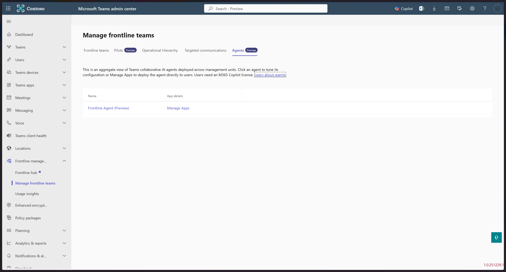

---
# Required metadata
# For more information, see https://learn.microsoft.com/en-us/help/platform/learn-editor-add-metadata
# For valid values of ms.service, ms.prod, and ms.topic, see https://learn.microsoft.com/en-us/help/platform/metadata-taxonomies

title: setupfrontlineagent
description: This article shows how to configure and deploy the Frontline Agent.
author:      npienkowska # GitHub alias
ms.author:   npienkowska # Microsoft alias
ms.service: microsoft-365
ms.topic: article
ms.date:     01/05/2026
ms.subservice: add-ins
---

# Set up Frontline agent for frontline workers

### Overview

Frontline Agent is an AI‑powered assistant in Microsoft 365 Copilot and Teams designed to support frontline workers and managers in their day‑to‑day operations. It helps frontline teams stay informed, complete tasks, and access the right information at the right time, all within the flow of work.

Frontline Agent works alongside Teams chats, channels, and existing Microsoft 365 services such as SharePoint, enabling organizations to scale frontline communication and operations without introducing new tools or workflows.

Built on Microsoft 365, Frontline Agent works within your existing Microsoft Teams security and compliance framework. It supports modern and shared devices, scales across regions and roles, and provides leaders with confidence that frontline work is supported by secure, enterprise‑grade collaboration and AI. You can use Microsoft Purview to mitigate and manage the risk associated with AI usage, including with Frontline Agent [here](/purview/ai-microsoft-purview). 

The agent is available for anyone with an M365 Copilot license in the agents section. As an IT administrator, you set up Frontline Agent to ensure it aligns with your organization’s policies for security, compliance, and device management.

### What scenarios does Frontline Agent enable?

__Quick access to information and guidance__

Frontline Agent allows workers to quickly find answers, documents, and guidance from approved sources such as SharePoint or Teams channels. This is especially useful in environments with frequent employee turnover or limited time for training.

__Catch up on missed communications at the start of a shift__

Frontline Agent helps frontline workers quickly catch up on important messages, updates, and tasks at the start of a shift without scrolling through long chat histories. It summarizes relevant conversations and highlights any actions that need to be taken. This helps workers start productive work faster and reduces missed information.

__Draft end-of-shift handovers__

Frontline Agent helps frontline managers create clear and consistent end‑of‑shift handovers. It summarizes completed work, flags open items and captures key updates that need to be passed to the next shift all from Teams chat and channel messages. This ensures continuity across shifts and reduces reliance on ad‑hoc messages.

### Prerequisites

1. __Identify the scenarios and training plan:__ Based on the capabilities above and the current frontline workflows, establish the most likely used prompts. Share these with your frontline workers and setup a one-time training session to help them understand the capabilities.

2. __Select an initial group of users:__ We suggest launching the agent at a few locations that are already using Microsoft Teams so you can observe how your frontline workers are adopting the use cases.

3. __Purchase M365 Copilot and assign licenses:__ Work with your sales team to purchase M365 Copilot licenses for the initial set of users.

### How to Set it Up

The agent will be discoverable from the M365 Copilot app store for all users who have the M365 Copilot license. To pin the agent for those users in M365 Copilot, click [here](/microsoft-365/admin/manage/agent-registry?view=o365-worldwide). If you’d like the agent to also show up in the Teams chat rail or scope down the SharePoint sites the agent has access to, please follow the instructions below.

> [!NOTE]
> If you don’t scope down to a set of SharePoint sites, the agent will provide answers from all the sites each user has access to.

1. Go to **Teams Admin center** > **Frontline management** > **Manage frontline teams** and then select **Agents**.

1. Click **Frontline Agent**. To limit the agent to specific SharePoint sites, paste in each Home site URL. If you add 10 sites and a user only has access to 2, the agent will answer using just those 2 sites.

1. Click **Manage apps** at the top.

1. Search for and click on Frontline Agent and then click on Users and Groups.

1. Click **Edit Availability** and specify the set of individuals or M365 group you want to deploy the agent to. Click **Apply**.

1. Go to **Teams apps** > **Setup policies** and click **Add**.

1. Add a name for your policy. Then, click **Add apps**.

1. Search for Frontline Agent and click **Add**. If you’d like to pin the agent to the Teams app rail for those users, you can. Click **Save**.

1. Then, click the checkmark to the left of the name of the policy and click **Manage users** and then **Assign users**. Add the set of individuals and click **Apply**. You can also assign the policy to an M365 group instead.

1. The Frontline Agent will send a welcome message to each user from the Teams chat rail. Your users can now use the agent!

