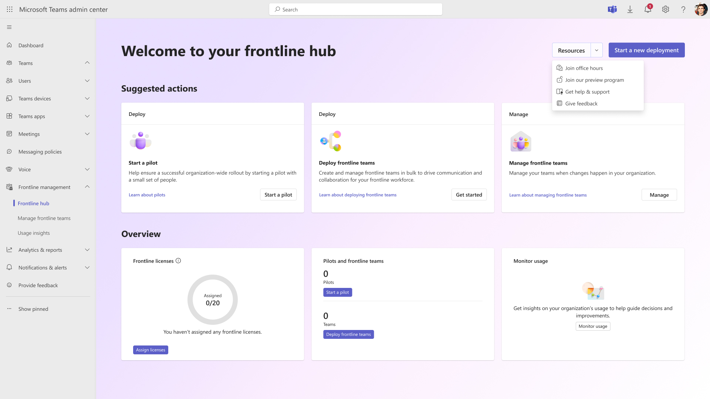
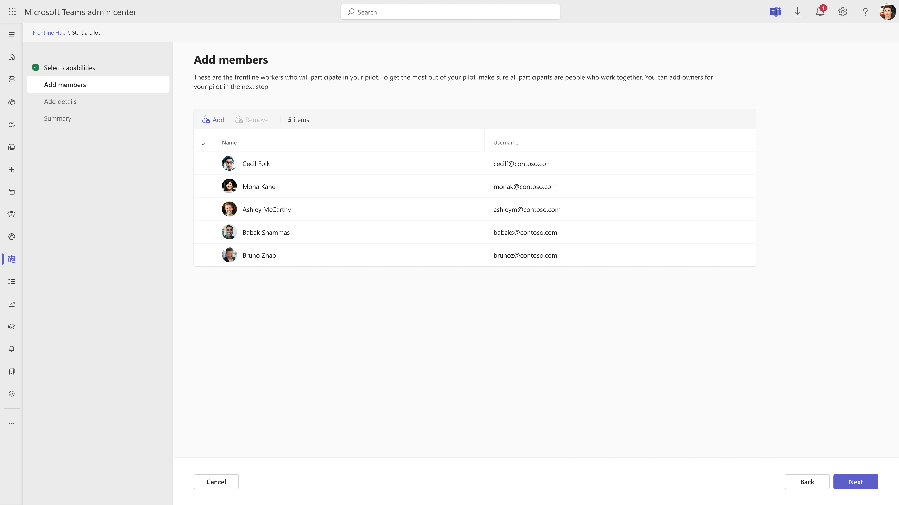
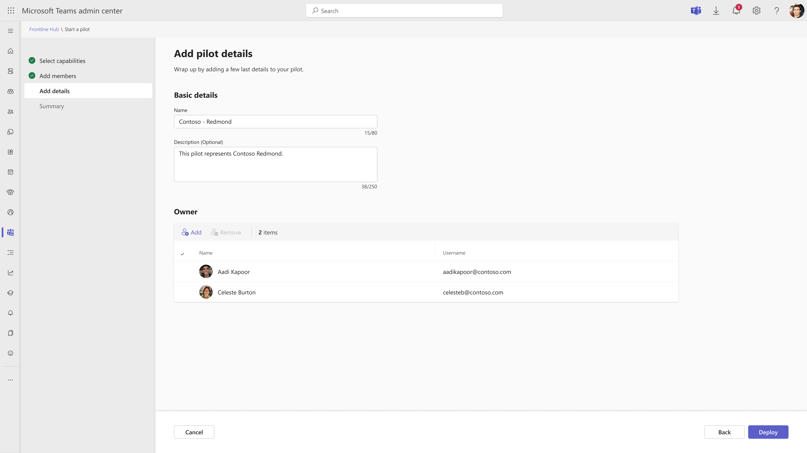
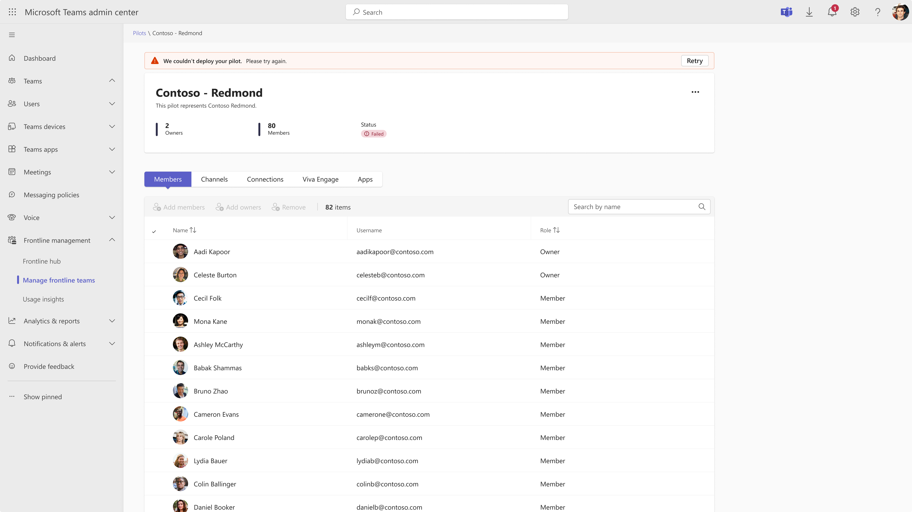
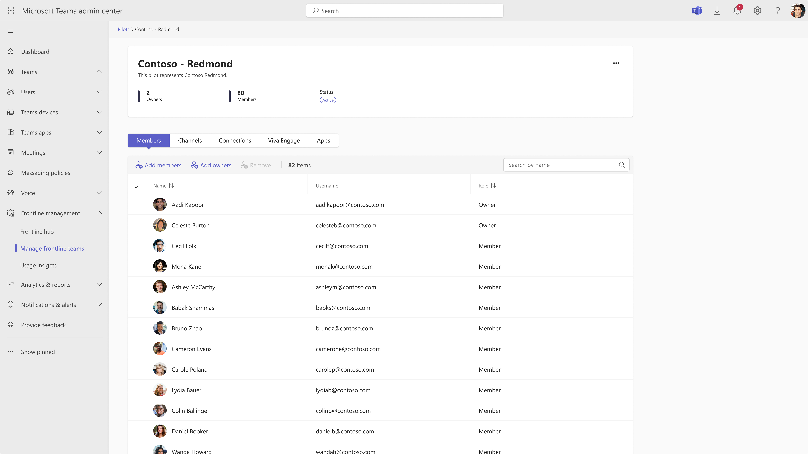
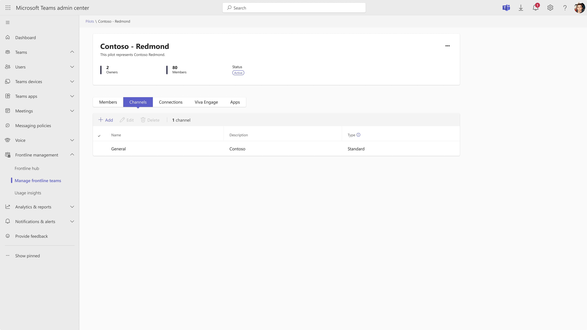
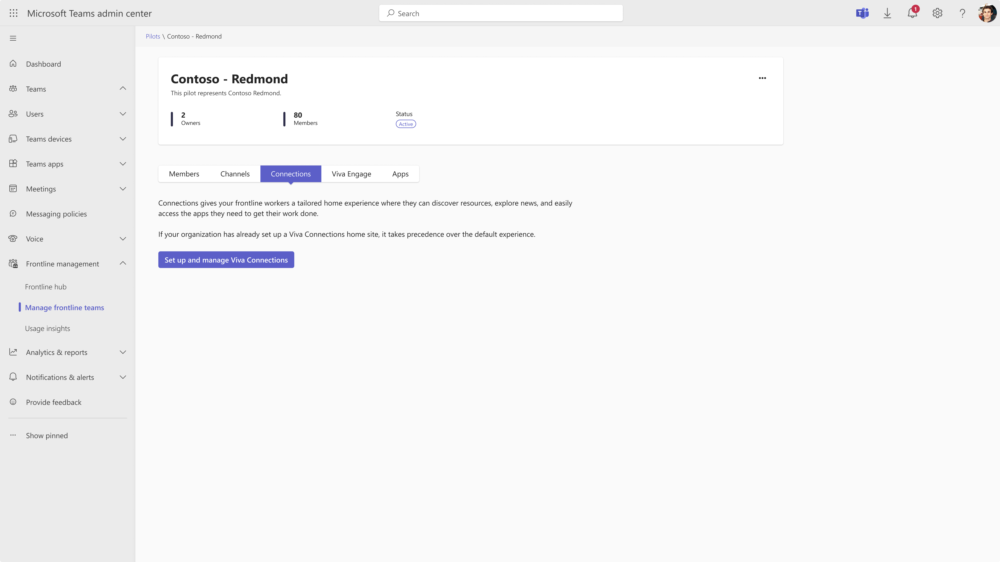
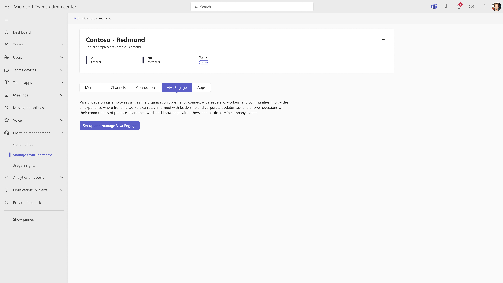
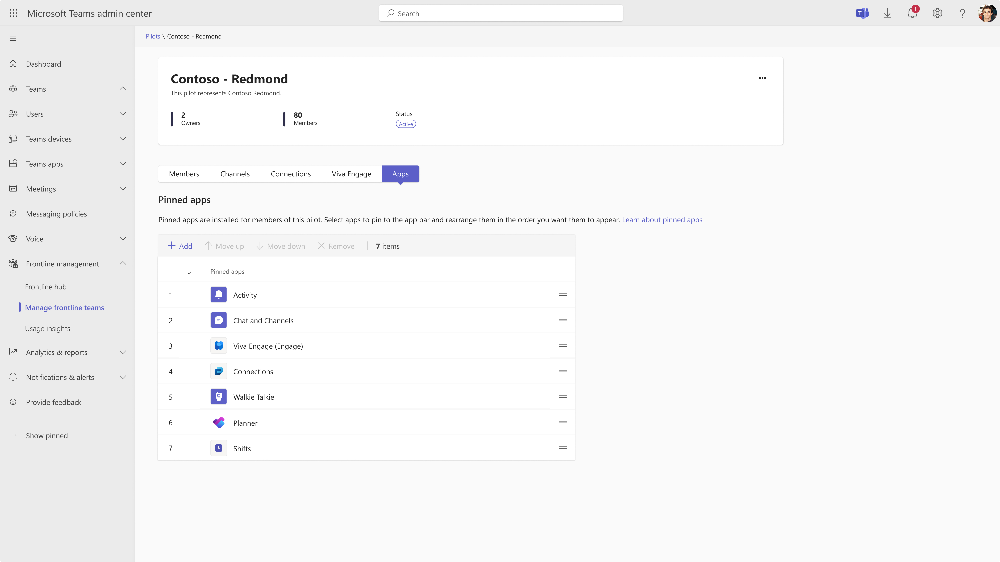
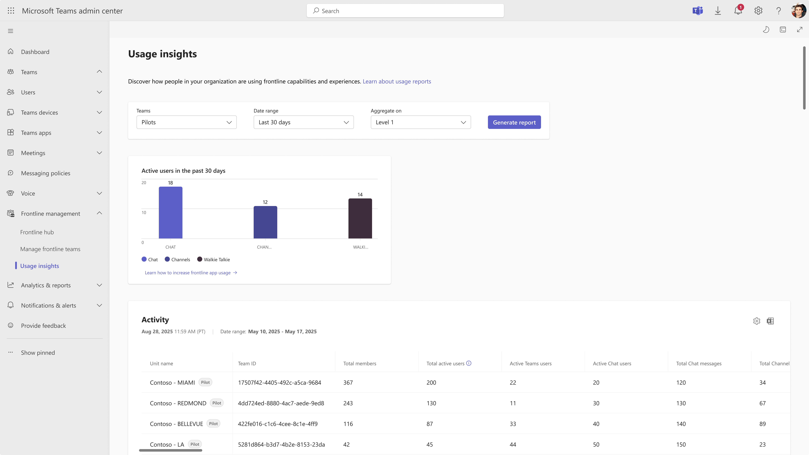

---
# Required metadata
# For more information, see https://learn.microsoft.com/en-us/help/platform/learn-editor-add-metadata
# For valid values of ms.service, ms.prod, and ms.topic, see https://learn.microsoft.com/en-us/help/platform/metadata-taxonomies

title:       Start a pilot for your frontline workers
description: Start simple and explore the value Microsoft Teams can offer your frontline workers by quickly launching a pilot from the Teams admin center.
author:      arnavgupta49
ms.author:   arnavgupta
ms.service:  ms.service
ms.topic:    Frontline deployment
ms.date:     10/26/2025
---

# Start a pilot for your frontline workers 

## Overview 

Start simple and explore the value Microsoft Teams can offer your frontline workers by quickly launching a pilot from the Teams admin center. Pilots allow you to pin and configure Microsoft Teams capabilities of your choice for a subset of users before broadly rolling out to the rest of your frontline workforce. Capabilities include Chat, Channels, Shifts, Planner, Walkie Talkie, Connections – Home and Engage Communities.

Over time, you can pin and configure more apps, change the order of pinned apps, standardize channels for frontline collaboration, and more to create a tailored experience that can be extended to the rest of your frontline workforce. Throughout your pilot, you can measure adoption of the apps you set up for your pilot with our usage dashboard as you continue to configure and modify the experience for your frontline workers.

## Why start a pilot?

Before you commit to a full rollout of Microsoft Teams for your entire frontline workforce, it's a good idea to try it out first with a small set of people in your organization. Starting with a pilot program first can help:
- Test Microsoft Teams features.
- Validate user readiness.
- Identify and mitigate issues.
- Ensure a successful, organization-wide rollout.

For example, a pilot can help you determine:
- Whether the scenarios you identified match the business needs of your organization.
- What elements need to be modified or further customized for your organization.
- What training and orientation information you need to provide to users before, during, and after they start working with these new tools.
## Before you begin

1. Ensure you are a Teams Admin or Global admin to have access to this tool in the Teams admin center.
2. Determine which features you want to enable for your frontline workers.
3. Define a set of users who you would like to start a pilot with. For best results, we recommend starting with a group of frontline workers and managers who work on the same team so you can truly assess which capabilities work best for frontline collaboration.

## How it works 

1. To get started, navigate to the __Frontline hub__ under Frontline management in the left navigation bar and click __Start a pilot__ under Suggested actions. Alternatively, you can click on __Start a new deployment__ on the top right corner and select __Start a pilot__.

2. When you click __Start a pilot__, you enter the pilot setup wizard where you are first asked to select the capabilities you would like to include in your pilot. Based on your selections, the apps under the “You will get” list are pinned on the Teams app bar for your tailored pilot experience. “Available apps” lists apps that are not pinned unless you select them. To learn more about specific capabilities, click on the app you would like to learn more about on the “You will get” or “Available Apps” lists. After completing this wizard, you can continue to configure, modify, and pin more apps to your pilot.

> [!IMPORTANT]
> All members of a pilot have access to Chat and become part of a team. You can add more Channels to the pilot team after completing this wizard. 

.jpg)

3. Next, add users to the pilot by clicking __Add members__ or __Add__ on the table. For best results, we recommend adding frontline workers who work on the same team to truly assess which capabilities work best for collaboration.

4. Give your pilot a name and an optional description.

5. Add user(s) who should be owner(s) of your pilot. We recommend you include frontline managers, department heads, or any other senior staff as owners. Learn more about what [permissions are granted to Owners](https://support.microsoft.com/en-us/office/team-owner-member-and-guest-capabilities-in-microsoft-teams-d03fdf5b-1a6e-48e4-8e07-b13e1350ec7b).

6. Click __Deploy__ to launch the pilot. This sets up the pilot experience with your selected pinned apps for members and owners of your pilot on Teams. This can take up to 30 minutes to complete.

7. Get your pilot users started by sharing the link or QR code to download Teams. When they download and log in to Teams, they see the pilot experience with your selected pinned apps on the Teams app bar. Communicate with your frontline workers and owners of their participation in the pilot, the pilot goals, and provide devices and training as necessary.

.jpg)

# Manage your pilot 

View, manage, and start new pilots in the Manage frontline teams tab. Now that you have initiated the pilot, managing your pilot allows you to add purpose-built channels to your pilot team, set up your preferred app pinning policy, configure apps like Connections - Home or Engage Communities, and more.

> [!IMPORTANT]
> You can start up to 5 pilots. Once you hit this limit, you must delete a pilot to start a new one.

.jpg)

To view the latest deployment status of the most recent pilots you have deployed, you can click the __Refresh icon__ on the top right corner of the table.

Clicking on a pilot allows you to enter the pilot’s detailed view which allows you to:

- View Deployment status

- Manage Membership: Adding/removing members and owners

- Manage Channels: Add/edit/remove standard channels

- Manage Connections: Configure Connections Home dashboard.

- Manage Engage Communities: Configure Engage Communities.

- Manage Apps: Add/remove apps and re-order pinned apps on the app bar.

On the pilot’s detailed view, you see a count of the total owners and total members along with the status of the pilot at the top. Underneath, there are five tabs for managing Members, Channels, Connections, Viva Engage and Apps.

#### Deployment status

Pilot status can be “Active”, “In progress”, or “Failed” based on if the pilot setup has been completed.

- If the status is “Active”, the pilot has been deployed, and members and owners of the pilot can see the pilot experience on their Teams client.

- If the status is “In progress”, refresh the page to see if the status has become “Active”.

- If the status is “Failed”, click the __Retry__ button on the banner to restart the pilot deployment.

#### Manage Membership

On the Members tab, all members and owners of the pilot are listed.

- You can click __Add members__ or __Add owners__ to add up to 20 members or owners at a time.

- To remove a member or owner, select the user and click __Remove.__

#### Manage channels 

By default, your frontline workers see a “General” channel which cannot be deleted.

- Add standard channels to your pilot by clicking on the __Channels__ tab in the pilot’s detailed view and clicking __Add__ on the table.

- To edit a channel’s name or description, click on the channel and click __Edit__ at the top of the table.

- To delete a channel, click on the channel and click __Delete__ at the top of the table.

> [!IMPORTANT]
> Admins can only add standard channels to the pilot in the Teams admin center. Owners of the pilot can add standard, private, and shared channels through the Teams client. On the Teams admin center, admins only see the standard channels they create.

#### Manage Connections

Configure the Connections Home Dashboard for your frontline workers by clicking Configure which will take you to a page to configure your Home dashboard for your pilot members.

#### Manage Viva Engage

Configure Communities for your frontline workers by clicking Configure which will take you to a page to configure Communities for your pilot members.

#### Manage Apps

Update the order in which apps are pinned on the Teams app bar for your pilot members by clicking and dragging an app up or down the table with the __‘=’ icon__ on the right side of the table.

- Alternatively, you can update the order of pinned apps by selecting an app and clicking __Move up__ or __Move down__ to change the position of an app on the app bar.

- Add more apps by clicking __Add__ at the top left corner of the table which can include third party apps.

- To unpin an app, select the app and click __Remove__.

## Measuring pilot success

Here's some tips for a successful pilot.

- Set start and end dates and define clear goals for measuring success. These goals can help you plan your rollout after the pilot is completed.

  - Allow enough time to run the pilot and assess its impact. A minimum of 30 days is recommended.
  
- Create a test plan, a process for gathering feedback, and a communication plan.

- Include the right stakeholders and participants. You can add more users throughout the pilot, if necessary, but make sure your participants include frontline workers and managers that work together, so you can:

  - Ensure you understand their challenges while planning the implementation.
  
  - Check to make sure your implementation is having a positive effect on those challenges.
  
- Take time to pause, measure adoption, and make adjustments as necessary.

Measure adoption of the capabilities you selected for your pilot in the **Usage insights** tab located on the left navigation bar under **Frontline Deployment**. To filter for pilots, select Pilots under the Teams dropdown, and then select the date range for which you want to see usage. Then, click **Generate report**.

Here, you see a bar graph of the total number of active users using Chat, Channels, and Walkie Talkie across all your pilots during your specified date range. On the table below, you see the number of active Chat users, active Teams users, total chat messages, total channel posts, and active Walkie Talkie users per pilot.

> [!NOTE]
>  Usage data for Shifts, Tasks, Engage Communities, Connections Home, will be coming soon to this dashboard.
> 

To help boost adoption, learn more about [enabling your frontline workers with Microsoft Teams](https://adoption.microsoft.com/microsoft-teams/frontline-workers/).

When you are ready to deploy this experience to the rest of your frontline workers, [deploy frontline teams with flexible membership](/microsoft-365/frontline/deploy-flexible-membership-teams-at-scale?view=o365-worldwide).

## Frequently Asked Questions

__Q: What is the difference between owners and members?__

__A:__ Learn more about [privileges granted to owners and members](https://support.microsoft.com/en-us/office/team-owner-member-and-guest-capabilities-in-microsoft-teams-d03fdf5b-1a6e-48e4-8e07-b13e1350ec7b). We recommend you add frontline workers as members and your frontline managers and senior staff as owners.

__Q: How are app policies assigned to users in a pilot?__ 

__A:__ When a pilot is created, the pilot members and owners are put into a group. This group is assigned an app setup policy based on the capabilities selected in the pilot. The group policy assignment rank is set to 1, overriding any previous policies assigned to those users.

__Q: What happens if a user is in 2 pilots with 2 different app policies?__ 

__A:__ We do not recommend including a user or owner in multiple pilots. However, the user receives the app configuration of the pilot with the most recently updated configurations.

__Q: What happens if the team owner adds a member or owner to the team from the Teams client? __

__A:__ The user or owners added will adopt the pilot configuration. As an admin, you can see all added members and owners if you click on the pilot and click on the Members tab.

__Q: Why if my pilot user or owner does not see the capabilities I selected in my pilot? __

__A:__ There are a few possible reasons.  

1. The user was directly assigned an app setup policy. If so, the direct user assignment always takes precedence over a group assignment.  

   1. How do I fix it? Remove the direct user assignment.
   
1. The group policy ranking has changed for your app setup policy.  

   1. How do I fix it? Navigate to the app setup page and check the group policy ranking. Ensure your pilot group policy has a rank of 1.
   
__Q: What happens if a pilot user unpins an app which was pinned by the admin?__

__A:__ The user can unpin an app, but the changes will only last temporarily. The next time the user logs in, the order of pinned apps will reset to the pilot configuration.

__Q: What happens if I delete a pilot?__

__A:__ When you delete a pilot, the team and channels associated with the pilot will not be deleted, but the pilot members’ and owners’ app bar will revert to the previous app policy that was active before the pilot. If there was no app policy active before, the app bar will return to the default Teams experience.

